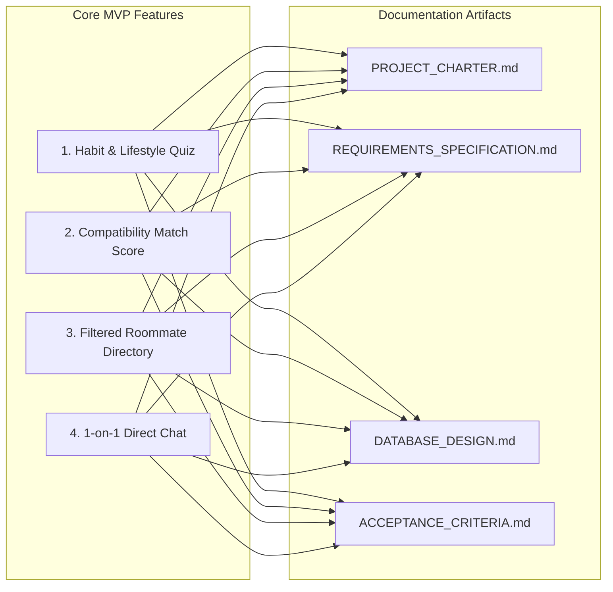
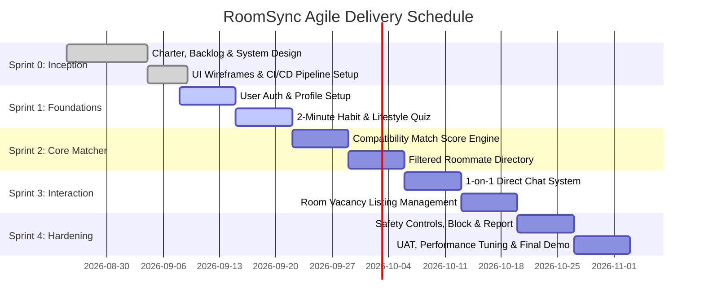

# RoomSync Documentation Suite
## Behavior-Based Roommate Matching Web Application

> **Course:** 192-304 Agile Software Development (BSc IT - Year 3)  
> **Course Lecturer:** Krissada Chalermsook (Oak)  
> **Student / Author:** Aeint Kyi Pyar Soe (6705140003) & Htet Soe Lin (6705140023)
> **Documentation Version:** 2.0.0 (Consolidated Agile Release)  
> **Status:** Active Sprint Baseline  

---

## 1. Executive Documentation Index

This directory contains the complete, authoritative agile documentation suite for **RoomSync**, synthesized and consolidated from team discovery artifacts into a single unified engineering baseline.

| Document | Primary Focus | Key Contents |
| :--- | :--- | :--- |
| [**`PROJECT_CHARTER.md`**](./PROJECT_CHARTER.md) | **Project Vision & Governance** | Vision statement, 4 MVP features, SMART objectives, scope boundaries, Scrum roles, sprint Gantt chart, tech architecture, and VUCA risk matrix. |
| [**`REQUIREMENTS_SPECIFICATION.md`**](./REQUIREMENTS_SPECIFICATION.md) | **Software Requirements (SRS)** | System context diagram, class domain model, 3 target personas, MoSCoW functional requirements, NFR quadrant chart, REST API specification, and RTM. |
| [**`DATABASE_DESIGN.md`**](./DATABASE_DESIGN.md) | **Database Architecture & DDL** | 3NF relational ER diagram, logical data dictionary, normalized habit vectors, scoring math formula, indexing strategy, executable SQL DDL, and realistic seed data. |
| [**`ACCEPTANCE_CRITERIA.md`**](./ACCEPTANCE_CRITERIA.md) | **BDD Acceptance & Quality Gates** | Definition of Ready (DoR), Definition of Done (DoD), product backlog sizing (US-01 to US-08), Gherkin scenarios, sequence diagram, edge cases, and QA checklist. |

---

## 2. Core MVP Feature Traceability

The table below demonstrates where each of our 4 core MVP capabilities is specified and validated across the consolidated documents:

### 1. Habit & Lifestyle Quiz
* **Concept & Scope**: 2-minute lifestyle assessment capturing sleep cycle, cleanliness index (1–5 scale), guest frequency, noise tolerance, and deal-breakers ([`PROJECT_CHARTER.md`](./PROJECT_CHARTER.md#51-in-scope-minimum-viable-product--mvp)).
* **Specification**: `FR-QUIZ-01` & `FR-QUIZ-02` with 5 discrete scales and state flow ([`REQUIREMENTS_SPECIFICATION.md`](./REQUIREMENTS_SPECIFICATION.md#epic-2-habit--lifestyle-assessment-quiz-hla)).
* **Data Schema**: `habit_profiles` table with numeric vectors and JSONB deal-breakers ([`DATABASE_DESIGN.md`](./DATABASE_DESIGN.md#33-table-habit_profiles)).
* **Verification**: `US-02` Gherkin BDD test scenarios and timing benchmarks under 2 minutes ([`ACCEPTANCE_CRITERIA.md`](./ACCEPTANCE_CRITERIA.md#us-02-2-minute-habit--lifestyle-assessment-quiz)).

### 2. Compatibility Match Score Engine
* **Concept & Scope**: Algorithmic 0–100% compatibility score calculation with visual habit tags and deal-breaker alerts ([`PROJECT_CHARTER.md`](./PROJECT_CHARTER.md#51-in-scope-minimum-viable-product--mvp)).
* **Specification**: `FR-ENG-01` & `FR-ENG-02` with Manhattan distance formula and category weights ([`REQUIREMENTS_SPECIFICATION.md`](./REQUIREMENTS_SPECIFICATION.md#epic-3-behavioral-compatibility-matching-engine-cme)).
* **Data Schema**: `match_scores` table caching pairwise calculations, category breakdowns, and conflict flags ([`DATABASE_DESIGN.md`](./DATABASE_DESIGN.md#34-table-match_scores)).
* **Verification**: `US-03` mathematical calculation verification scenarios and aligned habit chip generation ([`ACCEPTANCE_CRITERIA.md`](./ACCEPTANCE_CRITERIA.md#us-03-behavioral-compatibility-score--aligned-habit-tags)).

### 3. Filtered Roommate Directory
* **Concept & Scope**: Search and filter candidate profiles by budget range, target location/district, housing status, and minimum match percentage ([`PROJECT_CHARTER.md`](./PROJECT_CHARTER.md#51-in-scope-minimum-viable-product--mvp)).
* **Specification**: `FR-DIR-01` & `FR-DIR-02` multi-criteria slider controls and candidate card detail modals ([`REQUIREMENTS_SPECIFICATION.md`](./REQUIREMENTS_SPECIFICATION.md#epic-4-filtered-roommate-directory--candidate-discovery-frd)).
* **Data Schema**: `user_profiles` composite indexes for sub-50ms query filtering ([`DATABASE_DESIGN.md`](./DATABASE_DESIGN.md#5-indexing--query-optimization-strategy)).
* **Verification**: `US-04` Gherkin filter scenarios and empty-state fallback handling ([`ACCEPTANCE_CRITERIA.md`](./ACCEPTANCE_CRITERIA.md#us-04-filter-roommate-directory-by-budget-location-and-min-compatibility-)).

### 4. 1-on-1 Direct Chat System
* **Concept & Scope**: Secure in-app real-time messaging for matched candidates to discuss room specifics and arrange walkthroughs ([`PROJECT_CHARTER.md`](./PROJECT_CHARTER.md#51-in-scope-minimum-viable-product--mvp)).
* **Specification**: `FR-CHAT-01`, `FR-CHAT-02`, and `FR-CHAT-03` with WebSocket architecture and unread badges ([`REQUIREMENTS_SPECIFICATION.md`](./REQUIREMENTS_SPECIFICATION.md#epic-5-1-on-1-direct-messaging--communication-dmi)).
* **Data Schema**: `conversations`, `conversation_participants`, and `messages` tables ([`DATABASE_DESIGN.md`](./DATABASE_DESIGN.md#36-table-conversations-conversation_participants-and-messages)).
* **Verification**: `US-05` real-time message exchange sequence diagram and unread badge state tests ([`ACCEPTANCE_CRITERIA.md`](./ACCEPTANCE_CRITERIA.md#epic-5-1-on-1-direct-messaging--inquiry-chat)).

---

## 3. Agile Release Roadmap

---

## 4. Technology Stack Summary

* **Frontend**: React.js / Next.js with Tailwind CSS (Responsive mobile-first)
* **Backend API**: Node.js (Express) or Python (FastAPI) REST architecture
* **Database**: PostgreSQL 16+ with JSONB and GIN indexes (or SQLite 3.35+ for local testing)
* **Real-Time Layer**: WebSockets / Socket.io for low-latency direct messaging
* **Authentication**: JWT stateless bearer tokens + salted bcrypt password hashing ($\ge 10$ rounds)
* **Hosting & CI/CD**: Vercel / Render + GitHub Actions automated test workflows
