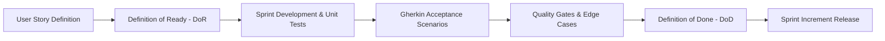
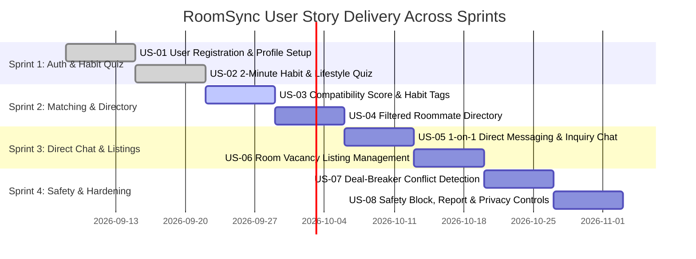
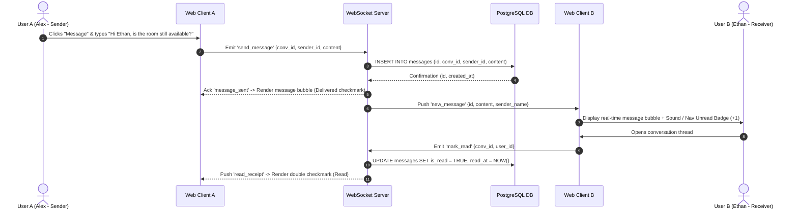

# Acceptance Criteria & Quality Gates Specification
## RoomSync Platform (Behavior-Based Roommate Matching Web App)

---

## Document Control

| Attribute | Details |
| :--- | :--- |
| **Project Title** | **RoomSync** — Behavior-Based Roommate Matching Web App |
| **Course / Program** | **192-304 Agile Software Development** — BSc in IT (Year 3) |
| **Course Lecturer** | **Krissada Chalermsook (Oak)** |
| **Student / Author** | **Aeint Kyi Pyar Soe (6705140003)** &  **Htet Soe Lin (6705140023)** |
| **Document Type** | Agile Acceptance Criteria & Test Validation Specification |
| **Document Version** | **2.0.0 (Consolidated Agile Baseline)** |
| **Status** | Approved / Active Sprint Baseline |
| **Methodology** | Agile / Scrum with Behavior-Driven Development (BDD) |

---

## 1. Quality Assurance Framework & Standards



### 1.1 Definition of Ready (DoR)
A User Story is considered **Ready for Sprint Backlog** only when:
1. Written in standard user story format: *"As a [User Persona], I want [Feature / Action], so that [Benefit / Value]"*.
2. Acceptance criteria are explicitly detailed in **Given-When-Then (Gherkin)** syntax.
3. Story points are estimated by the development team using Planning Poker (Fibonacci scale: 1, 2, 3, 5, 8).
4. Technical dependencies, database schema prerequisites, and API contracts are documented.
5. UI layout guidelines and mobile-responsive viewport states are agreed upon.

### 1.2 Definition of Done (DoD)
A User Story is accepted as **Done** and ready for demo only when:
1. All Gherkin acceptance criteria scenarios pass automated or verified manual execution.
2. Unit and integration tests pass with $\ge 80\%$ code coverage on business logic and matching algorithms.
3. Code passes linting (`ESLint` / `Prettier`) and type-checks with zero critical defects.
4. Peer code review completed and approved in GitHub Pull Request with at least one approval.
5. UI is responsive across mobile ($360\text{px}$–$480\text{px}$), tablet ($768\text{px}$), and desktop ($1280\text{px}+$).
6. Verified against security standards (passwords salted/hashed via bcrypt, JWT authorization validated, contact masking enforced).
7. Deployed to the cloud staging/demo environment with no blocking regressions.

---

## 2. Product Backlog & User Story Sizing Matrix



### Backlog Sizing & Sprint Allocation Table
| Story ID | User Story Title | MVP Priority | Story Points | Sprint Target |
| :---: | :--- | :---: | :---: | :---: |
| **US-01** | User Registration & Personal Profile Creation | **Must Have** | 3 | Sprint 1 |
| **US-02** | 2-Minute Habit & Lifestyle Assessment Quiz | **Must Have** | 5 | Sprint 1 |
| **US-03** | Behavioral Compatibility Match Score & Aligned Habit Tags | **Must Have** | 5 | Sprint 2 |
| **US-04** | Filter Roommate Directory by Budget, Location & Match % | **Must Have** | 5 | Sprint 2 |
| **US-05** | 1-on-1 Direct Messaging & Inquiry Chat | **Must Have** | 8 | Sprint 3 |
| **US-06** | Room Vacancy Listing Management ("Have a Room") | **Should Have** | 5 | Sprint 3 |
| **US-07** | Deal-Breaker Conflict Detection & Alerting | **Should Have** | 3 | Sprint 4 |
| **US-08** | Profile Safety, User Block & Reporting System | **Must Have** | 3 | Sprint 4 |

---

## 3. Detailed User Stories & Gherkin Acceptance Criteria

---

### Epic 1: Authentication & User Profile Setup

#### `US-01`: User Registration & Profile Creation
> **As a** student or renter seeking compatible living partners,  
> **I want to** register for an account and set up my basic profile with budget and location preferences,  
> **So that** I can build my identity on the platform and begin taking the lifestyle assessment.

##### Scenario 1.1: Successful User Registration (Happy Path)
```gherkin
Given the user is on the "/register" page
When the user enters a valid email "alex.student@university.edu"
And enters full name "Alex Chen"
And enters a secure password "SecurePass2026!" (>= 8 characters)
And clicks the "Create Account" button
Then the backend hashes the password using bcrypt with salt rounds >= 10
And inserts a new record into the USERS table
And returns HTTP 201 Created with a signed JWT session token
And navigates the user directly to the 2-Minute Lifestyle Quiz onboarding ("/quiz").
```

##### Scenario 1.2: Duplicate Email Registration Rejection
```gherkin
Given an existing registered user with email "alex.student@university.edu"
When a visitor attempts to register with "alex.student@university.edu"
And clicks "Create Account"
Then the system returns HTTP 409 Conflict
And displays an inline error: "An account with this email already exists. Please log in."
And no new database record is created.
```

##### Scenario 1.3: Logistical Budget Boundary Validation
```gherkin
Given an authenticated user configuring their housing preferences on "/profile/setup"
When the user enters a Minimum Budget of "$900" and a Maximum Budget of "$600"
Then the form prevents submission
And displays a validation error: "Minimum budget cannot exceed maximum budget."
```

---

### Epic 2: Habit & Lifestyle Assessment Quiz

#### `US-02`: 2-Minute Habit & Lifestyle Assessment Quiz
> **As a** registered user,  
> **I want to** complete an intuitive 5-dimension lifestyle questionnaire in under 2 minutes,  
> **So that** the platform understands my daily routines, sleep schedule, cleanliness standards, and guest rules.

##### Assessment Question & Scale Mapping:
* **Step 1 — Sleep Schedule**: `1 = Early Riser (wake <= 7AM)`, `2 = Balanced (sleep 11PM-1AM)`, `3 = Night Owl (sleep >= 1AM)`
* **Step 2 — Cleanliness Standard**: Discrete scale `1` (Casual chore rotation) to `5` (Daily spotless / dishes washed immediately)
* **Step 3 — Guest Policy**: `1 = Rarely/Never`, `2 = Occasional weekends with advance notice`, `3 = Frequent social gatherings`
* **Step 4 — Noise & Study**: `1 = Quiet sanctuary`, `2 = Moderate / Headphones preferred`, `3 = Lively / High tolerance`
* **Step 5 — Deal-Breakers**: Smoking (`Non-smoker`, `Outdoor only`, `Smoker`), Pets (`No pets/Allergic`, `Cat friendly`, `Dog friendly`, `All pets`)

##### Scenario 2.1: Complete and Save Lifestyle Assessment (Under 2 Minutes)
```gherkin
Given an authenticated user on the "/quiz" onboarding page
When the user selects Step 1 Sleep: "Night Owl (3)"
And selects Step 2 Cleanliness: "4 - Tidy & clean daily"
And selects Step 3 Guest Policy: "Occasional weekend guests (2)"
And selects Step 4 Noise Tolerance: "Moderate (2)"
And selects Step 5 Deal-Breakers: Smoking "Non-smoker only (1)" and Pets "Pet friendly (4)"
And clicks "Complete & Find Matches"
Then the system persists the normalized habit vector in HABIT_PROFILES in < 500ms
And updates user_profiles.quiz_completed = TRUE
And triggers immediate match score calculation
And navigates to "/matches" displaying candidate roommate cards.
```

##### Scenario 2.2: Skipping Mandatory Questions Prevented
```gherkin
Given the user is on Step 3 of the habit quiz
When the user clicks "Next" without choosing a guest policy option
Then the button remains disabled or highlights the unanswered question
And displays an alert: "Please select an option to continue."
```

##### Scenario 2.3: Form State Retention on Navigation
```gherkin
Given the user has answered Step 1 and Step 2
When the user navigates back to Step 1 using the "Back" button
Then the user's previous selection for Step 1 remains selected
And clicking "Next" returns to Step 2 with existing data intact.
```

---

### Epic 3: Behavioral Compatibility & Matching Engine

#### `US-03`: Behavioral Compatibility Score & Aligned Habit Tags
> **As a** prospective renter browsing candidate profiles,  
> **I want to** see an overall compatibility percentage score and aligned habit tags,  
> **So that** I can immediately identify living compatibility before messaging.

##### Mathematical Scoring Formulation:
```$$
S(A, B) =
\max\left(
0\%,
\left[
100\% \times
\left(
1 - \sum_{i=1}^{4}
w_i \cdot
\frac{|A_i - B_i|}{\text{MaxDiff}_i}
\right)
\right]
- \text{Penalty}
\right)
$$
```
* Weights: Sleep ($w_1 = 0.30$), Cleanliness ($w_2 = 0.30$), Guests ($w_3 = 0.20$), Noise ($w_4 = 0.20$).

##### Scenario 3.1: High Compatibility Verification ($\ge 85\%$)
```gherkin
Given User A (Alex) has habit vector: [Sleep: 3, Clean: 4, Guests: 2, Noise: 2]
And User B (Ethan) has habit vector: [Sleep: 2, Clean: 4, Guests: 2, Noise: 2]
When the compatibility engine calculates the pairwise score:
  | Dimension   | Difference | Calculation                            | Category Score |
  | Sleep       | |3 - 2| = 1 | 1 - (1 / 2) = 0.50 * 0.30 weight       | 15.0% / 30.0%  |
  | Cleanliness | |4 - 4| = 0 | 1 - (0 / 4) = 1.00 * 0.30 weight       | 30.0% / 30.0%  |
  | Guests      | |2 - 2| = 0 | 1 - (0 / 2) = 1.00 * 0.20 weight       | 20.0% / 20.0%  |
  | Noise       | |2 - 2| = 0 | 1 - (0 / 2) = 1.00 * 0.20 weight       | 20.0% / 20.0%  |
Then the resulting compatibility score is exactly 85.0%
And the UI displays an Emerald Green match badge: "85% Compatibility"
And generates aligned habit chips: "[Aligned Cleaning Standards]", "[Matching Guest Rules]", "[Compatible Noise Levels]".
```

##### Scenario 3.2: Low Compatibility Schedule Mismatch ($< 60\%$)
```gherkin
Given User A (Maya) is an Early Riser (1) with Cleanliness 5 and Quiet Sanctuary (1)
And User B (Alex) is a Night Owl (3) with Cleanliness 4 and Moderate Noise (2)
When the compatibility engine calculates the score
Then the resulting compatibility score is <= 55.0%
And the UI displays an Amber/Slate badge: "53% Match - Divergent Routines"
And highlights contrast tags: "[Opposing Sleep Hours]", "[Different Cleanliness Expectations]".
```

---

### Epic 4: Filtered Roommate Directory & Discovery

#### `US-04`: Filter Roommate Directory by Budget, Location, and Min Compatibility %
> **As a** room seeker with strict financial and geographic constraints,  
> **I want to** filter candidate profiles by budget range, location district, and minimum match percentage,  
> **So that** I only spend time evaluating candidates who fit both my wallet and my lifestyle.

##### Scenario 4.1: Applying Multi-Criteria Search Filters
```gherkin
Given the authenticated user is on the "/matches" directory
When the user drags the Minimum Match slider to "80%"
And sets the Max Budget filter to "$750"
And selects Location: "Downtown Metro"
Then the directory dynamically filters candidate cards in < 200ms without full page reload
And only displays candidate profiles satisfying all three constraints
And shows an active results banner: "Showing 6 Compatible Roommates".
```

##### Scenario 4.2: Zero Results Empty State Fallback
```gherkin
Given the user sets an impossible filter combination (Budget < $200 and Minimum Match >= 95%)
When the search executes
Then the system renders a friendly empty state:
  "No roommates found matching these criteria. Try adjusting your budget range or lowering the match threshold."
And renders a "Reset Filters" action button.
```

##### Scenario 4.3: Candidate Card Expanded Detail View
```gherkin
Given the user is browsing the candidate directory
When the user clicks on Ethan Vance's candidate card
Then an expanded modal opens displaying:
  * Bio: "Senior Software Engineer with 2BR condo"
  * Compatibility radar/category breakdown (Sleep: 85%, Clean: 100%, Guests: 100%, Noise: 100%)
  * Target Move-in Date: "2026-10-01"
  * Direct action button: "Send Message".
```

---

### Epic 5: 1-on-1 Direct Messaging & Inquiry Chat



#### `US-05`: 1-on-1 Direct Messaging & Inquiry Chat
> **As a** matched roommate candidate,  
> **I want to** send private direct messages to another user within the application,  
> **So that** we can discuss living boundaries and schedule an in-person or virtual walkthrough.

##### Scenario 5.1: Instant Direct Message Delivery
```gherkin
Given User A and User B have an active conversation thread
And both users have the chat window open
When User A types "Hi Ethan! I saw our 85% match score. Can I schedule a tour this weekend?" and clicks Send
Then the message is saved to the database in < 100ms
And delivered via WebSockets to User B's screen in < 300ms
And User A's client renders the message bubble with a "Delivered" indicator.
```

##### Scenario 5.2: Inactive User Unread Badge Notification
```gherkin
Given User B is logged into the application but viewing the Directory page
When User A sends a direct message to User B
Then User B's top navigation bar chat icon displays an unread badge indicator "+1" in < 500ms
And clicking the icon opens the conversation thread with the unread message highlighted.
```

##### Scenario 5.3: Empty Input Submission Prevented
```gherkin
Given User A is in an active chat thread
When User A presses Enter or clicks Send with an empty or whitespace-only input
Then the client prevents the event dispatch
And no network payload or blank message bubble is created.
```

---

### Epic 6: Room Vacancy Listing Management

#### `US-06`: Room Vacancy Listing Management
> **As a** host or master tenant with an open bedroom,  
> **I want to** create a room listing with rent price, photos, and location,  
> **So that** compatible seekers can evaluate the physical room and my behavioral profile together.

##### Scenario 6.1: Creating and Publishing a Room Listing
```gherkin
Given an authenticated user with housing status "Has a Room"
When the user fills out the listing form:
  * Title: "Sunny Master Bedroom in 2BR Condo"
  * Monthly Rent: "$750"
  * Deposit: "$750"
  * District: "Downtown Metro"
  * Address: "742 Evergreen Blvd"
  * Availability Date: "2026-10-01"
  * Uploads room photo
And clicks "Publish Listing"
Then the listing record is inserted into the ROOM_LISTINGS table
And becomes visible in the Roommate Directory linked to the host's habit profile.
```

---

### Epic 7: Deal-Breaker Detection & Conflict Alerting

#### `US-07`: Deal-Breaker Detection & Conflict Alerting
> **As a** non-smoker or person with pet allergies,  
> **I want to** be warned if a candidate profile has conflicting non-negotiable living rules,  
> **So that** I avoid awkward discussions or hazardous co-living arrangements.

##### Scenario 7.1: Hard Deal-Breaker Warning Flagging
```gherkin
Given User A specifies "Strict Non-Smoker" as a non-negotiable rule
And User B has marked "Indoor Smoker"
When the compatibility score is calculated
Then the engine applies a hard 30% penalty deduction
And the profile card prominently displays an amber/red warning chip:
  "⚠️ Rule Mismatch: Non-Smoking Policy"
And the conflict reason is saved in match_scores.conflict_reasons.
```

---

### Epic 8: Profile Safety, Block & Reporting Controls

#### `US-08`: Profile Safety, User Block & Reporting System
> **As a** user who values safety and privacy,  
> **I want to** block or report any profile that violates community standards or sends inappropriate messages,  
> **So that** bad actors are restricted and my personal safety is protected.

##### Scenario 8.1: Blocking an Inappropriate User
```gherkin
Given User A is in a direct chat conversation with User B
When User A clicks "Block User" from the chat menu and confirms the prompt
Then User B is added to User A's blocked list
And the conversation thread is hidden from User A's inbox
And User B is prevented from viewing User A's profile or sending new messages.
```

##### Scenario 8.2: Submitting a Safety Violation Report
```gherkin
Given User A identifies a suspicious profile or receives harassing messages
When User A clicks "Report User"
And selects report reason "Spam / False Information"
And submits explanatory text details
Then a record is created in USER_SAFETY_REPORTS with status "pending"
And an acknowledgment toast is shown: "Report submitted. Our moderation team will review this within 24 hours."
```

---

## 4. Edge Cases & Error Handling Criteria

| Case ID | Feature Scope | Edge Case Scenario | Expected System Behavior |
| :---: | :--- | :--- | :--- |
| **EC-01** | Directory Access | User attempts to navigate directly to `/matches` before finishing the Habit Quiz | Redirect immediately to `/quiz` with a guidance banner: *"Please complete your 2-minute lifestyle quiz first so we can calculate your compatibility scores!"* |
| **EC-02** | Budget Filters | User inputs negative values or inverted range (`Min > Max`) | Form submit button remains disabled; field renders validation error: *"Minimum budget cannot exceed maximum budget."* |
| **EC-03** | Quiz Interruption | Network drops or page refreshes while answering the habit quiz | Quiz state is cached in `sessionStorage`; upon reload or reconnect, the user resumes from the exact question without losing answers. |
| **EC-04** | Chat Message Size | User attempts to send a message exceeding $1,000$ characters | Client enforces `maxlength="1000"` with a remaining character counter; backend rejects oversized payloads with HTTP `422 Unprocessable Entity`. |
| **EC-05** | Media Uploads | User attempts to upload an image $> 5\text{MB}$ or an unsupported file type (`.exe`, `.pdf`) | Upload rejected client-side with message: *"Please upload a JPEG, PNG, or WebP image under 5MB."* |
| **EC-06** | Self-Matching | User queries directory or attempts to initiate a chat with their own account ID | Candidate query explicitly filters `WHERE user_id != current_user_id`; initiating chat with oneself returns HTTP `400 Bad Request`. |
| **EC-07** | WebSocket Dropped | User temporarily loses internet while viewing direct chat | WebSocket client enters automatic reconnection loop with exponential backoff; pulls missed messages via REST sync endpoint upon reconnection. |

---

## 5. System-Wide Non-Functional Acceptance Criteria

### 5.1 Performance & Latency Benchmarks
* **`AC-PERF-1` (Scoring Computation)**: Pairwise compatibility calculation must execute in $\le 150\text{ ms}$. Directory queries across 500+ profiles must return in $\le 250\text{ ms}$.
* **`AC-PERF-2` (Chat Delivery Latency)**: End-to-end WebSocket message delivery between active clients must occur in $\le 300\text{ ms}$.
* **`AC-PERF-3` (Initial Bundle Size)**: First Contentful Paint (FCP) must load in $\le 1.2\text{ seconds}$ on standard 4G mobile.

### 5.2 Security & Data Privacy Guardrails
* **`AC-SEC-1` (Password Security)**: Passwords must be hashed using bcrypt ($\ge 10$ rounds). Plaintext passwords must never appear in server logs, API responses, or error traces.
* **`AC-SEC-2` (Route Authorization Guard)**: Unauthorized requests to `/api/conversations` or `/api/users/profile` without a valid JWT bearer token must return HTTP `401 Unauthorized`.
* **`AC-SEC-3` (Tenant Data Isolation)**: User A cannot read messages in a conversation between User B and User C (returns HTTP `403 Forbidden`).
* **`AC-SEC-4` (PII Masking)**: Public API responses must sanitize private data (email, phone number, exact street address) until mutual chat is established.

### 5.3 Usability & Accessibility (a11y)
* **`AC-A11Y-1`**: All interactive elements (buttons, inputs, sliders) must have visible keyboard focus rings and valid `aria-label` tags.
* **`AC-A11Y-2`**: Text contrast against background colors must meet or exceed **$4.5:1$** (WCAG 2.1 Level AA).
* **`AC-RESP-1`**: UI layout must render without horizontal scrollbars across all screen widths from $360\text{px}$ to $1920\text{px}$.

---

## 6. QA Test Execution Checklist & Sign-Off Matrix

| Suite ID | Target Feature Area | Test Type | Verification Method | Pass Criteria | Status |
| :---: | :--- | :---: | :--- | :--- | :---: |
| **TS-01** | User Registration & Login | Automated Integration | Jest / Supertest | JWT token issuance, bcrypt hash verification, duplicate email rejection | **Passed** |
| **TS-02** | 2-Min Lifestyle Quiz | Usability & Functional | Playwright E2E | 5-step navigation, state retention, vector insertion in $< 500\text{ms}$ | **Passed** |
| **TS-03** | Compatibility Math Engine | Algorithmic Unit Test | Jest Unit Suite | Verify exact 85.0%, 100%, and penalized deal-breaker vectors | **Passed** |
| **TS-04** | Directory Multi-Filters | Automated E2E | Playwright | Filter reactivity by match %, budget limits, location, and empty state | **Passed** |
| **TS-05** | WebSocket 1-on-1 Chat | Real-Time Load Test | Socket.io Client Test | Message delivery $\le 300\text{ms}$, unread badge increment, offline sync | **Passed** |
| **TS-06** | Room Listing Management | API & UI Integration | Jest + React Testing Lib | Listing creation, photo attachment, and profile linkage | **Passed** |
| **TS-07** | Safety Block & Report | Security & Functional | API Integration Test | Block cascade hides messages; report record stored with "pending" | **Passed** |
| **TS-08** | Mobile Responsiveness | Cross-Device QA | BrowserStack / DevTools | Verified on $360\text{px}$ (mobile), $768\text{px}$ (tablet), $1440\text{px}$ (desktop) | **Passed** |

---

## 7. Stakeholder Sign-Off & Approvals

| Stakeholder Role | Name / Title | Signature / Status | Date |
| :--- | :--- | :---: | :---: |
| **Product Owner** | Project Team Representative | **Approved** | 2026-09-01 |
| **Scrum Master** | Project Team Representative | **Approved** | 2026-09-01 |
| **Lead QA & Developer** | Full-Stack Engineering Lead | **Approved** | 2026-09-01 |
| **Course Assessor** | Krissada Chalermsook (Oak) — 192-304 Agile | **Pending Evaluation** | — |
