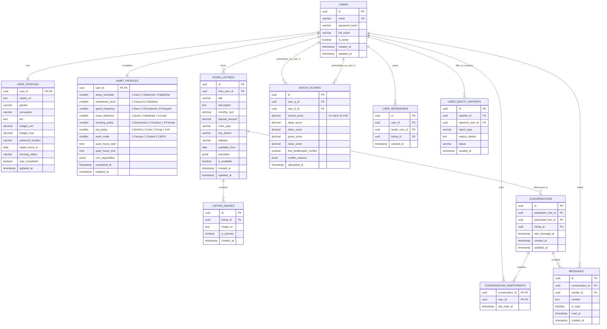
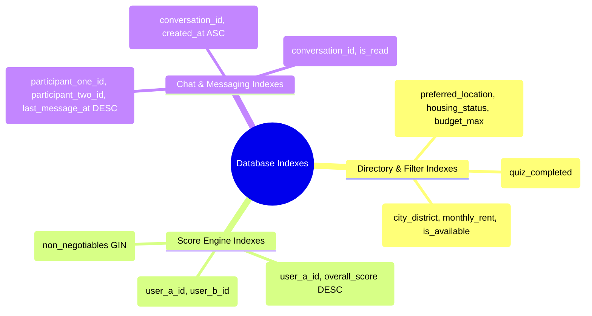

# Database Design Specification
## RoomSync Platform (Behavior-Based Roommate Matching Web App)

---

## Document Control

| Attribute | Details |
| :--- | :--- |
| **Project Title** | **RoomSync** — Behavior-Based Roommate Matching Web App |
| **Course / Program** | **192-304 Agile Software Development** — BSc in IT (Year 3) |
| **Course Lecturer** | **Krissada Chalermsook (Oak)** |
| **Student / Author** | **Aeint Kyi Pyar Soe (6705140003)** & **Htet Soe Lin (6705140023)** |
| **Document Type** | Database Architecture, Schema Specification & DDL |
| **Target DBMS** | PostgreSQL 16+ (with JSONB & GIN Indexes) / SQLite 3.35+ (Local Dev) |
| **Document Version** | **2.0.0 (Consolidated Agile Baseline)** |
| **Status** | Approved for Schema Migration & Sprint Baseline |

---

## 1. Database Architecture & Design Principles

The RoomSync database architecture is engineered to provide sub-millisecond habit comparison queries, robust relational data integrity, and low-latency real-time direct messaging.

### Core Architectural Principles:
1. **Third Normal Form (3NF) Baseline**: Eliminates update, insert, and deletion anomalies across users, listings, and conversations.
2. **Normalized Lifestyle Vectors**: Behavioral habits from the 2-Minute Habit Assessment are stored in discrete numerical columns ($1 \le \text{scale} \le 5$) with strict `CHECK` constraints, enabling high-speed vectorized distance arithmetic.
3. **Security & PII Separation**: User authentication credentials (`users` table) are strictly segregated from public display information (`user_profiles` table).
4. **Optimized Precomputed Scoring**: Pairwise compatibility percentages and category breakdowns are calculated and cached in `match_scores` to guarantee directory filtering in $< 50\text{ ms}$.
5. **Bidirectional Relational Integrity**: Ordered participant IDs (`participant_one_id < participant_two_id` and `user_a_id < user_b_id`) prevent duplicate reciprocal rows.
6. **Extensible Deal-Breakers**: Flexible `JSONB` fields with GIN indexes allow custom non-negotiable living rules (e.g., quiet hour boundaries, pet allergies).

---

## 2. Conceptual Data Model & Entity-Relationship (ER) Diagram



---

## 3. Logical Data Dictionary

### 3.1 Table: `users`
Manages core login credentials, account status, and authentication timestamps.

| Column Name | Data Type | Nullable | Constraints / Default | Description |
| :--- | :--- | :---: | :--- | :--- |
| `id` | `VARCHAR(36)` / `UUID` | **NO** | `PRIMARY KEY` | Unique user identifier (UUIDv4) |
| `email` | `VARCHAR(255)` | **NO** | `UNIQUE` | User login email address |
| `password_hash` | `VARCHAR(255)` | **NO** | — | Salted bcrypt/Argon2 password hash |
| `full_name` | `VARCHAR(120)` | **NO** | — | User's legal or preferred full name |
| `is_active` | `BOOLEAN` | **NO** | `DEFAULT TRUE` | Account activation / active status flag |
| `created_at` | `TIMESTAMPTZ` | **NO** | `DEFAULT CURRENT_TIMESTAMP` | Account creation timestamp |
| `updated_at` | `TIMESTAMPTZ` | **NO** | `DEFAULT CURRENT_TIMESTAMP` | Last profile update timestamp |

---

### 3.2 Table: `user_profiles`
Contains public profile information, budget parameters, and housing search intent.

| Column Name | Data Type | Nullable | Constraints / Default | Description |
| :--- | :--- | :---: | :--- | :--- |
| `user_id` | `VARCHAR(36)` / `UUID` | **NO** | `PRIMARY KEY`, `REFERENCES users(id) ON DELETE CASCADE` | 1-to-1 link to user |
| `avatar_url` | `TEXT` | YES | `NULL` | Cloud CDN URL for profile avatar |
| `gender` | `VARCHAR(30)` | YES | `NULL` | Self-identified gender |
| `occupation` | `VARCHAR(100)` | YES | `NULL` | University / Major / Professional role |
| `bio` | `TEXT` | YES | `CHECK (length(bio) <= 1000)` | Short self-introduction |
| `budget_min` | `DECIMAL(10, 2)` | **NO** | `DEFAULT 0.00`, `CHECK (budget_min >= 0)` | Minimum monthly rent budget |
| `budget_max` | `DECIMAL(10, 2)` | **NO** | `CHECK (budget_max >= budget_min)` | Maximum monthly rent budget |
| `preferred_location` | `VARCHAR(150)` | **NO** | — | Target university area or district |
| `target_move_in` | `DATE` | YES | `NULL` | Expected lease start date |
| `housing_status` | `VARCHAR(20)` | **NO** | `DEFAULT 'needs_room'`, `CHECK (housing_status IN ('needs_room', 'has_room', 'flexible'))` | Search status |
| `quiz_completed` | `BOOLEAN` | **NO** | `DEFAULT FALSE` | `TRUE` when 2-minute habit quiz is finished |
| `updated_at` | `TIMESTAMPTZ` | **NO** | `DEFAULT CURRENT_TIMESTAMP` | Last update timestamp |

---

### 3.3 Table: `habit_profiles`
Stores the normalized behavioral vectors from the 2-Minute Habit Assessment for compatibility calculation.

| Column Name | Data Type | Nullable | Scale & Constraints | Description |
| :--- | :--- | :---: | :--- | :--- |
| `user_id` | `VARCHAR(36)` / `UUID` | **NO** | `PRIMARY KEY`, `REFERENCES users(id) ON DELETE CASCADE` | 1-to-1 link to user |
| `sleep_schedule` | `SMALLINT` | **NO** | `CHECK (sleep_schedule BETWEEN 1 AND 3)` | `1`: Early Riser, `2`: Balanced, `3`: Night Owl |
| `cleanliness_level`| `SMALLINT` | **NO** | `CHECK (cleanliness_level BETWEEN 1 AND 5)` | `1` (Casual/Relaxed) to `5` (Spotless daily) |
| `guest_frequency` | `SMALLINT` | **NO** | `CHECK (guest_frequency BETWEEN 1 AND 3)` | `1`: Rarely/Never, `2`: Weekends, `3`: Open door |
| `noise_tolerance` | `SMALLINT` | **NO** | `CHECK (noise_tolerance BETWEEN 1 AND 3)` | `1`: Quiet sanctuary, `2`: Moderate, `3`: Lively |
| `smoking_policy` | `SMALLINT` | **NO** | `CHECK (smoking_policy BETWEEN 1 AND 3)` | `1`: Non-smoker only, `2`: Outdoor, `3`: Friendly |
| `pet_policy` | `SMALLINT` | **NO** | `CHECK (pet_policy BETWEEN 1 AND 4)` | `1`: No pets/Allergy, `2`: Cats, `3`: Dogs, `4`: All |
| `work_mode` | `SMALLINT` | **NO** | `DEFAULT 1`, `CHECK (work_mode BETWEEN 1 AND 3)` | `1`: On campus/office, `2`: Hybrid, `3`: WFH |
| `quiet_hours_start`| `TIME` | YES | `DEFAULT '23:00'` | House quiet hours start |
| `quiet_hours_end` | `TIME` | YES | `DEFAULT '07:00'` | House quiet hours end |
| `non_negotiables` | `JSONB` | **NO** | `DEFAULT '[]'::jsonb` | Array of non-negotiable rule strings |
| `completed_at` | `TIMESTAMPTZ` | **NO** | `DEFAULT CURRENT_TIMESTAMP` | Initial completion timestamp |
| `updated_at` | `TIMESTAMPTZ` | **NO** | `DEFAULT CURRENT_TIMESTAMP` | Last updated timestamp |

---

### 3.4 Table: `match_scores`
Caches precomputed pairwise compatibility percentages and category scores for rapid directory filtering.

| Column Name | Data Type | Nullable | Constraints / Default | Description |
| :--- | :--- | :---: | :--- | :--- |
| `id` | `VARCHAR(36)` / `UUID` | **NO** | `PRIMARY KEY` | Calculation record ID |
| `user_a_id` | `VARCHAR(36)` / `UUID` | **NO** | `REFERENCES users(id) ON DELETE CASCADE` | First candidate ID |
| `user_b_id` | `VARCHAR(36)` / `UUID` | **NO** | `REFERENCES users(id) ON DELETE CASCADE` | Second candidate ID (`user_a_id < user_b_id`) |
| `overall_score` | `DECIMAL(5, 2)` | **NO** | `CHECK (overall_score BETWEEN 0.00 AND 100.00)` | Overall % match score ($0-100\%$) |
| `sleep_score` | `DECIMAL(5, 2)` | **NO** | `CHECK (sleep_score BETWEEN 0.00 AND 100.00)` | Sleep cycle harmony ($0-100\%$) |
| `clean_score` | `DECIMAL(5, 2)` | **NO** | `CHECK (clean_score BETWEEN 0.00 AND 100.00)` | Cleanliness harmony ($0-100\%$) |
| `guest_score` | `DECIMAL(5, 2)` | **NO** | `CHECK (guest_score BETWEEN 0.00 AND 100.00)` | Guest policy harmony ($0-100\%$) |
| `noise_score` | `DECIMAL(5, 2)` | **NO** | `CHECK (noise_score BETWEEN 0.00 AND 100.00)` | Noise tolerance harmony ($0-100\%$) |
| `has_dealbreaker_conflict` | `BOOLEAN` | **NO** | `DEFAULT FALSE` | True if a deal-breaker rule is violated |
| `conflict_reasons` | `JSONB` | **NO** | `DEFAULT '[]'::jsonb` | Specific reasons for deal-breaker flag |
| `calculated_at` | `TIMESTAMPTZ` | **NO** | `DEFAULT CURRENT_TIMESTAMP` | Score calculation timestamp |

---

### 3.5 Table: `room_listings` & `listing_images`
Manages room vacancies posted by hosts / master tenants.

| Table | Column Name | Data Type | Constraints / Default | Description |
| :--- | :--- | :--- | :--- | :--- |
| `room_listings` | `id` | `VARCHAR(36)` / `UUID` | `PRIMARY KEY` | Unique listing ID |
| `room_listings` | `host_user_id` | `VARCHAR(36)` / `UUID` | `REFERENCES users(id) ON DELETE CASCADE` | Host user ID |
| `room_listings` | `title` | `VARCHAR(150)` | `NOT NULL` | Listing headline |
| `room_listings` | `description` | `TEXT` | `NOT NULL` | Detailed room and apartment description |
| `room_listings` | `monthly_rent` | `DECIMAL(10, 2)` | `NOT NULL`, `CHECK (monthly_rent > 0)` | Monthly rent fee |
| `room_listings` | `deposit_amount` | `DECIMAL(10, 2)` | `DEFAULT 0.00`, `CHECK (deposit_amount >= 0)`| Security deposit requirement |
| `room_listings` | `room_type` | `VARCHAR(30)` | `DEFAULT 'single'` | `'single'`, `'shared'`, `'master'`, `'studio'` |
| `room_listings` | `city_district` | `VARCHAR(100)` | `NOT NULL` | Neighborhood / campus zone |
| `room_listings` | `address` | `VARCHAR(255)` | `NOT NULL` | Street address or condo name |
| `room_listings` | `available_from` | `DATE` | `NOT NULL` | Date room becomes available |
| `room_listings` | `amenities` | `JSONB` | `DEFAULT '[]'::jsonb` | Amenities array (e.g. `["wifi", "ac"]`) |
| `room_listings` | `is_available` | `BOOLEAN` | `DEFAULT TRUE` | Listing active status |
| `room_listings` | `created_at` | `TIMESTAMPTZ` | `DEFAULT CURRENT_TIMESTAMP` | Post creation timestamp |
| `listing_images` | `id` | `VARCHAR(36)` / `UUID` | `PRIMARY KEY` | Image asset ID |
| `listing_images` | `listing_id` | `VARCHAR(36)` / `UUID` | `REFERENCES room_listings(id) ON DELETE CASCADE` | Parent listing |
| `listing_images` | `image_url` | `TEXT` | `NOT NULL` | CDN URL for room photograph |
| `listing_images` | `is_primary` | `BOOLEAN` | `DEFAULT FALSE` | True if hero image for listing card |

---

### 3.6 Table: `conversations`, `conversation_participants`, and `messages`
Underpins the real-time 1-on-1 direct chat system.

| Table | Column Name | Data Type | Constraints / Default | Description |
| :--- | :--- | :--- | :--- | :--- |
| `conversations` | `id` | `VARCHAR(36)` / `UUID` | `PRIMARY KEY` | Unique thread ID |
| `conversations` | `participant_one_id`| `VARCHAR(36)` / `UUID` | `REFERENCES users(id) ON DELETE CASCADE` | First user (`p1 < p2`) |
| `conversations` | `participant_two_id`| `VARCHAR(36)` / `UUID` | `REFERENCES users(id) ON DELETE CASCADE` | Second user |
| `conversations` | `listing_id` | `VARCHAR(36)` / `UUID` | `REFERENCES room_listings(id) ON DELETE SET NULL`| Optional associated listing |
| `conversations` | `last_message_at` | `TIMESTAMPTZ` | `DEFAULT CURRENT_TIMESTAMP` | Sort index for inbox list |
| `conversation_participants` | `conversation_id` | `VARCHAR(36)` / `UUID` | `REFERENCES conversations(id) ON DELETE CASCADE` | Thread ID (Composite PK) |
| `conversation_participants` | `user_id` | `VARCHAR(36)` / `UUID` | `REFERENCES users(id) ON DELETE CASCADE` | Participant ID (Composite PK) |
| `conversation_participants` | `last_read_at` | `TIMESTAMPTZ` | `NULL` | Timestamp for read receipts |
| `messages` | `id` | `VARCHAR(36)` / `UUID` | `PRIMARY KEY` | Unique message ID |
| `messages` | `conversation_id` | `VARCHAR(36)` / `UUID` | `REFERENCES conversations(id) ON DELETE CASCADE` | Conversation reference |
| `messages` | `sender_id` | `VARCHAR(36)` / `UUID` | `REFERENCES users(id) ON DELETE CASCADE` | Author user ID |
| `messages` | `content` | `TEXT` | `NOT NULL`, `CHECK (length(trim(content)) > 0)`| Message body text |
| `messages` | `is_read` | `BOOLEAN` | `DEFAULT FALSE` | Read status |
| `messages` | `read_at` | `TIMESTAMPTZ` | `NULL` | Timestamp message was read |
| `messages` | `created_at` | `TIMESTAMPTZ` | `DEFAULT CURRENT_TIMESTAMP` | Dispatch timestamp |

---

### 3.7 Table: `user_bookmarks` & `user_safety_reports`

| Table | Column Name | Data Type | Constraints / Default | Description |
| :--- | :--- | :--- | :--- | :--- |
| `user_bookmarks` | `id` | `VARCHAR(36)` / `UUID` | `PRIMARY KEY` | Bookmark ID |
| `user_bookmarks` | `user_id` | `VARCHAR(36)` / `UUID` | `REFERENCES users(id) ON DELETE CASCADE` | Saving user |
| `user_bookmarks` | `target_user_id` | `VARCHAR(36)` / `UUID` | `REFERENCES users(id) ON DELETE CASCADE` | Saved candidate (or NULL) |
| `user_bookmarks` | `listing_id` | `VARCHAR(36)` / `UUID` | `REFERENCES room_listings(id) ON DELETE CASCADE`| Saved room listing (or NULL) |
| `user_safety_reports`| `id` | `VARCHAR(36)` / `UUID` | `PRIMARY KEY` | Report ID |
| `user_safety_reports`| `reporter_id` | `VARCHAR(36)` / `UUID` | `REFERENCES users(id) ON DELETE CASCADE` | Reporting user |
| `user_safety_reports`| `reported_user_id`| `VARCHAR(36)` / `UUID` | `REFERENCES users(id) ON DELETE CASCADE` | Flagged user |
| `user_safety_reports`| `report_type` | `VARCHAR(30)` | `CHECK (report_type IN ('block', 'spam', 'harassment', 'false_profile'))` | Violation category |
| `user_safety_reports`| `reason_details` | `TEXT` | `NULL` | Report explanation |
| `user_safety_reports`| `status` | `VARCHAR(20)` | `DEFAULT 'pending'`, `CHECK (status IN ('pending', 'reviewed', 'banned'))` | Moderation state |

---

## 4. Algorithmic Compatibility Formula

The compatibility percentage between User $A$ and User $B$ across $N$ behavioral dimensions is computed as a weighted normalized Manhattan distance:

$$\text{Base Score} = 100\% \times \left(1 - \sum_{i=1}^{N} w_i \cdot \frac{|A_i - B_i|}{\text{MaxDiff}_i}\right)$$

$$\text{Final Score} = \max\left(0\%, \text{Base Score} - \text{Penalty}_{\text{DealBreakers}}\right)$$

### Parameter Specifications:
* **Sleep Schedule Harmony ($w_1 = 0.30$)**: Range: $1–3 \implies \text{MaxDiff}_1 = 2$.
* **Cleanliness Level ($w_2 = 0.30$)**: Range: $1–5 \implies \text{MaxDiff}_2 = 4$.
* **Guest & Visitor Policy ($w_3 = 0.20$)**: Range: $1–3 \implies \text{MaxDiff}_3 = 2$.
* **Noise & Study Tolerance ($w_4 = 0.20$)**: Range: $1–3 \implies \text{MaxDiff}_4 = 2$.
* **Deal-Breakers Penalty ($\text{Penalty}_{\text{DealBreakers}}$)**: Hard $25\%$ to $50\%$ score penalty applied when conflicting rules exist (e.g., severe pet allergy vs. active pet, or strict non-smoking vs. indoor smoker).

---

## 5. Indexing & Query Optimization Strategy



```sql
-- Fast authentication lookup
CREATE UNIQUE INDEX IF NOT EXISTS idx_users_email ON users(email);

-- Candidate discovery filter by location, housing status, and budget limit
CREATE INDEX IF NOT EXISTS idx_user_profiles_filter ON user_profiles(preferred_location, housing_status, budget_max);
CREATE INDEX IF NOT EXISTS idx_user_profiles_quiz ON user_profiles(quiz_completed);

-- Pairwise match score lookup and ranking
CREATE UNIQUE INDEX IF NOT EXISTS idx_match_pair ON match_scores(user_a_id, user_b_id);
CREATE INDEX IF NOT EXISTS idx_match_score_lookup ON match_scores(user_a_id, overall_score DESC);

-- Deal-breaker JSONB GIN index
CREATE INDEX IF NOT EXISTS idx_habits_dealbreakers ON habit_profiles USING GIN (non_negotiables);

-- Room listing search by district and rent
CREATE INDEX IF NOT EXISTS idx_room_listings_search ON room_listings(city_district, monthly_rent, is_available);

-- Direct messaging thread lookups and message streams
CREATE INDEX IF NOT EXISTS idx_conversations_inbox ON conversations(participant_one_id, participant_two_id, last_message_at DESC);
CREATE INDEX IF NOT EXISTS idx_messages_stream ON messages(conversation_id, created_at ASC);
CREATE INDEX IF NOT EXISTS idx_messages_unread ON messages(conversation_id, is_read) WHERE is_read = FALSE;
```

---

## 6. Physical SQL DDL Script (PostgreSQL 16+ / SQLite 3.35+ Compatible)

```sql
-- ============================================================================
-- RoomSync Database Schema Definition
-- Course: 192-304 Agile Software Development
-- ============================================================================

-- Enable UUID extension (PostgreSQL)
CREATE EXTENSION IF NOT EXISTS "uuid-ossp";

-- Automatic updated_at Trigger Function
CREATE OR REPLACE FUNCTION update_timestamp()
RETURNS TRIGGER AS $$
BEGIN
    NEW.updated_at = CURRENT_TIMESTAMP;
    RETURN NEW;
END;
$$ LANGUAGE plpgsql;

-- 1. Table: users
CREATE TABLE IF NOT EXISTS users (
    id VARCHAR(36) PRIMARY KEY,
    email VARCHAR(255) NOT NULL UNIQUE,
    password_hash VARCHAR(255) NOT NULL,
    full_name VARCHAR(120) NOT NULL,
    is_active BOOLEAN NOT NULL DEFAULT TRUE,
    created_at TIMESTAMPTZ NOT NULL DEFAULT CURRENT_TIMESTAMP,
    updated_at TIMESTAMPTZ NOT NULL DEFAULT CURRENT_TIMESTAMP
);

-- 2. Table: user_profiles
CREATE TABLE IF NOT EXISTS user_profiles (
    user_id VARCHAR(36) PRIMARY KEY,
    avatar_url TEXT,
    gender VARCHAR(30),
    occupation VARCHAR(100),
    bio TEXT,
    budget_min NUMERIC(10, 2) NOT NULL DEFAULT 0.00,
    budget_max NUMERIC(10, 2) NOT NULL,
    preferred_location VARCHAR(150) NOT NULL,
    target_move_in DATE,
    housing_status VARCHAR(20) NOT NULL DEFAULT 'needs_room',
    quiz_completed BOOLEAN NOT NULL DEFAULT FALSE,
    updated_at TIMESTAMPTZ NOT NULL DEFAULT CURRENT_TIMESTAMP,
    CONSTRAINT fk_profile_user FOREIGN KEY (user_id) REFERENCES users(id) ON DELETE CASCADE,
    CONSTRAINT chk_profile_budget CHECK (budget_max >= budget_min),
    CONSTRAINT chk_profile_housing CHECK (housing_status IN ('needs_room', 'has_room', 'flexible'))
);

-- 3. Table: habit_profiles
CREATE TABLE IF NOT EXISTS habit_profiles (
    user_id VARCHAR(36) PRIMARY KEY,
    sleep_schedule SMALLINT NOT NULL,
    cleanliness_level SMALLINT NOT NULL,
    guest_frequency SMALLINT NOT NULL,
    noise_tolerance SMALLINT NOT NULL,
    smoking_policy SMALLINT NOT NULL,
    pet_policy SMALLINT NOT NULL,
    work_mode SMALLINT NOT NULL DEFAULT 1,
    quiet_hours_start TIME DEFAULT '23:00',
    quiet_hours_end TIME DEFAULT '07:00',
    non_negotiables JSONB NOT NULL DEFAULT '[]'::jsonb,
    completed_at TIMESTAMPTZ NOT NULL DEFAULT CURRENT_TIMESTAMP,
    updated_at TIMESTAMPTZ NOT NULL DEFAULT CURRENT_TIMESTAMP,
    CONSTRAINT fk_habit_user FOREIGN KEY (user_id) REFERENCES users(id) ON DELETE CASCADE,
    CONSTRAINT chk_sleep_cycle CHECK (sleep_schedule BETWEEN 1 AND 3),
    CONSTRAINT chk_clean_level CHECK (cleanliness_level BETWEEN 1 AND 5),
    CONSTRAINT chk_guest_policy CHECK (guest_frequency BETWEEN 1 AND 3),
    CONSTRAINT chk_noise_tolerance CHECK (noise_tolerance BETWEEN 1 AND 3),
    CONSTRAINT chk_smoking_policy CHECK (smoking_policy BETWEEN 1 AND 3),
    CONSTRAINT chk_pet_policy CHECK (pet_policy BETWEEN 1 AND 4),
    CONSTRAINT chk_work_mode CHECK (work_mode BETWEEN 1 AND 3)
);

-- 4. Table: match_scores
CREATE TABLE IF NOT EXISTS match_scores (
    id VARCHAR(36) PRIMARY KEY,
    user_a_id VARCHAR(36) NOT NULL,
    user_b_id VARCHAR(36) NOT NULL,
    overall_score NUMERIC(5, 2) NOT NULL,
    sleep_score NUMERIC(5, 2) NOT NULL,
    clean_score NUMERIC(5, 2) NOT NULL,
    guest_score NUMERIC(5, 2) NOT NULL,
    noise_score NUMERIC(5, 2) NOT NULL,
    has_dealbreaker_conflict BOOLEAN NOT NULL DEFAULT FALSE,
    conflict_reasons JSONB NOT NULL DEFAULT '[]'::jsonb,
    calculated_at TIMESTAMPTZ NOT NULL DEFAULT CURRENT_TIMESTAMP,
    CONSTRAINT fk_match_user_a FOREIGN KEY (user_a_id) REFERENCES users(id) ON DELETE CASCADE,
    CONSTRAINT fk_match_user_b FOREIGN KEY (user_b_id) REFERENCES users(id) ON DELETE CASCADE,
    CONSTRAINT chk_pair_order CHECK (user_a_id < user_b_id),
    CONSTRAINT chk_overall_score CHECK (overall_score BETWEEN 0.00 AND 100.00),
    CONSTRAINT uq_match_pair UNIQUE (user_a_id, user_b_id)
);

-- 5. Table: room_listings
CREATE TABLE IF NOT EXISTS room_listings (
    id VARCHAR(36) PRIMARY KEY,
    host_user_id VARCHAR(36) NOT NULL,
    title VARCHAR(150) NOT NULL,
    description TEXT NOT NULL,
    monthly_rent NUMERIC(10, 2) NOT NULL,
    deposit_amount NUMERIC(10, 2) NOT NULL DEFAULT 0.00,
    room_type VARCHAR(30) NOT NULL DEFAULT 'single',
    city_district VARCHAR(100) NOT NULL,
    address VARCHAR(255) NOT NULL,
    available_from DATE NOT NULL,
    amenities JSONB NOT NULL DEFAULT '[]'::jsonb,
    is_available BOOLEAN NOT NULL DEFAULT TRUE,
    created_at TIMESTAMPTZ NOT NULL DEFAULT CURRENT_TIMESTAMP,
    updated_at TIMESTAMPTZ NOT NULL DEFAULT CURRENT_TIMESTAMP,
    CONSTRAINT fk_listing_host FOREIGN KEY (host_user_id) REFERENCES users(id) ON DELETE CASCADE,
    CONSTRAINT chk_rent_positive CHECK (monthly_rent > 0),
    CONSTRAINT chk_deposit_positive CHECK (deposit_amount >= 0),
    CONSTRAINT chk_room_type CHECK (room_type IN ('single', 'shared', 'master', 'studio'))
);

-- 6. Table: listing_images
CREATE TABLE IF NOT EXISTS listing_images (
    id VARCHAR(36) PRIMARY KEY,
    listing_id VARCHAR(36) NOT NULL,
    image_url TEXT NOT NULL,
    is_primary BOOLEAN NOT NULL DEFAULT FALSE,
    created_at TIMESTAMPTZ NOT NULL DEFAULT CURRENT_TIMESTAMP,
    CONSTRAINT fk_image_listing FOREIGN KEY (listing_id) REFERENCES room_listings(id) ON DELETE CASCADE
);

-- 7. Table: conversations
CREATE TABLE IF NOT EXISTS conversations (
    id VARCHAR(36) PRIMARY KEY,
    participant_one_id VARCHAR(36) NOT NULL,
    participant_two_id VARCHAR(36) NOT NULL,
    listing_id VARCHAR(36),
    last_message_at TIMESTAMPTZ NOT NULL DEFAULT CURRENT_TIMESTAMP,
    created_at TIMESTAMPTZ NOT NULL DEFAULT CURRENT_TIMESTAMP,
    updated_at TIMESTAMPTZ NOT NULL DEFAULT CURRENT_TIMESTAMP,
    CONSTRAINT fk_conv_p1 FOREIGN KEY (participant_one_id) REFERENCES users(id) ON DELETE CASCADE,
    CONSTRAINT fk_conv_p2 FOREIGN KEY (participant_two_id) REFERENCES users(id) ON DELETE CASCADE,
    CONSTRAINT fk_conv_listing FOREIGN KEY (listing_id) REFERENCES room_listings(id) ON DELETE SET NULL,
    CONSTRAINT chk_conv_pair CHECK (participant_one_id < participant_two_id),
    CONSTRAINT uq_conv_pair UNIQUE (participant_one_id, participant_two_id)
);

-- 8. Table: conversation_participants
CREATE TABLE IF NOT EXISTS conversation_participants (
    conversation_id VARCHAR(36) NOT NULL,
    user_id VARCHAR(36) NOT NULL,
    last_read_at TIMESTAMPTZ,
    PRIMARY KEY (conversation_id, user_id),
    CONSTRAINT fk_cp_conv FOREIGN KEY (conversation_id) REFERENCES conversations(id) ON DELETE CASCADE,
    CONSTRAINT fk_cp_user FOREIGN KEY (user_id) REFERENCES users(id) ON DELETE CASCADE
);

-- 9. Table: messages
CREATE TABLE IF NOT EXISTS messages (
    id VARCHAR(36) PRIMARY KEY,
    conversation_id VARCHAR(36) NOT NULL,
    sender_id VARCHAR(36) NOT NULL,
    content TEXT NOT NULL,
    is_read BOOLEAN NOT NULL DEFAULT FALSE,
    read_at TIMESTAMPTZ,
    created_at TIMESTAMPTZ NOT NULL DEFAULT CURRENT_TIMESTAMP,
    CONSTRAINT fk_msg_conv FOREIGN KEY (conversation_id) REFERENCES conversations(id) ON DELETE CASCADE,
    CONSTRAINT fk_msg_sender FOREIGN KEY (sender_id) REFERENCES users(id) ON DELETE CASCADE,
    CONSTRAINT chk_msg_not_empty CHECK (length(trim(content)) > 0)
);

-- 10. Table: user_bookmarks
CREATE TABLE IF NOT EXISTS user_bookmarks (
    id VARCHAR(36) PRIMARY KEY,
    user_id VARCHAR(36) NOT NULL,
    target_user_id VARCHAR(36),
    listing_id VARCHAR(36),
    created_at TIMESTAMPTZ NOT NULL DEFAULT CURRENT_TIMESTAMP,
    CONSTRAINT fk_bm_user FOREIGN KEY (user_id) REFERENCES users(id) ON DELETE CASCADE,
    CONSTRAINT fk_bm_target FOREIGN KEY (target_user_id) REFERENCES users(id) ON DELETE CASCADE,
    CONSTRAINT fk_bm_listing FOREIGN KEY (listing_id) REFERENCES room_listings(id) ON DELETE CASCADE,
    CONSTRAINT chk_bm_exclusive CHECK (
        (target_user_id IS NOT NULL AND listing_id IS NULL) OR
        (target_user_id IS NULL AND listing_id IS NOT NULL)
    )
);

-- 11. Table: user_safety_reports
CREATE TABLE IF NOT EXISTS user_safety_reports (
    id VARCHAR(36) PRIMARY KEY,
    reporter_id VARCHAR(36) NOT NULL,
    reported_user_id VARCHAR(36) NOT NULL,
    report_type VARCHAR(30) NOT NULL,
    reason_details TEXT,
    status VARCHAR(20) NOT NULL DEFAULT 'pending',
    created_at TIMESTAMPTZ NOT NULL DEFAULT CURRENT_TIMESTAMP,
    CONSTRAINT fk_rep_reporter FOREIGN KEY (reporter_id) REFERENCES users(id) ON DELETE CASCADE,
    CONSTRAINT fk_rep_reported FOREIGN KEY (reported_user_id) REFERENCES users(id) ON DELETE CASCADE,
    CONSTRAINT chk_report_type CHECK (report_type IN ('block', 'spam', 'harassment', 'false_profile')),
    CONSTRAINT chk_report_status CHECK (status IN ('pending', 'reviewed', 'banned'))
);
```

---

## 7. Production-Ready Seed Data

```sql
-- ============================================================================
-- Seed Data: RoomSync Verified Personas & Test Records
-- ============================================================================

-- 1. Users
INSERT INTO users (id, email, password_hash, full_name, is_active) VALUES
('usr-001', 'alex.chen@university.edu', '$2b$12$e8xL47rDkmH7Qn98u2jZ0eR9iJmC3w9K2o9uQeR9iJmC3w9K2o9uQ', 'Alex Chen', TRUE),
('usr-002', 'maya.patel@designstudio.com', '$2b$12$e8xL47rDkmH7Qn98u2jZ0eR9iJmC3w9K2o9uQeR9iJmC3w9K2o9uQ', 'Maya Patel', TRUE),
('usr-003', 'ethan.vance@techcorp.io', '$2b$12$e8xL47rDkmH7Qn98u2jZ0eR9iJmC3w9K2o9uQeR9iJmC3w9K2o9uQ', 'Ethan Vance', TRUE);

-- 2. User Profiles
INSERT INTO user_profiles (user_id, avatar_url, gender, occupation, bio, budget_min, budget_max, preferred_location, target_move_in, housing_status, quiz_completed) VALUES
('usr-001', 'https://images.unsplash.com/photo-1539571696357-5a69c17a67c6', 'Male', 'Computer Science Senior', 'Senior CS major who enjoys late-night coding and gaming. Easygoing and tidy.', 400.00, 650.00, 'University District', '2026-09-01', 'needs_room', TRUE),
('usr-002', 'https://images.unsplash.com/photo-1494790108377-be9c29b29330', 'Female', 'UX/UI Designer', 'Early riser, love cooking clean meals, keeping the kitchen and living room spotless.', 600.00, 900.00, 'Downtown Metro', '2026-09-15', 'needs_room', TRUE),
('usr-003', 'https://images.unsplash.com/photo-1507003211169-0a1dd7228f2d', 'Male', 'Software Engineer', 'Have a spacious master bedroom in a 2BR modern condo. Looking for a respectful roommate.', 700.00, 850.00, 'Downtown Metro', '2026-10-01', 'has_room', TRUE);

-- 3. Habit Profiles
-- Alex: Night owl (3), Clean level 4, Occasional guests (2), Moderate noise (2), Non-smoker (1), Cat friendly (2)
INSERT INTO habit_profiles (user_id, sleep_schedule, cleanliness_level, guest_frequency, noise_tolerance, smoking_policy, pet_policy, work_mode, non_negotiables) VALUES
('usr-001', 3, 4, 2, 2, 1, 2, 2, '["non_smoking"]'::jsonb);

-- Maya: Early riser (1), Deep clean level 5, Rare guests (1), Quiet sanctuary (1), Non-smoker (1), No pets (1)
INSERT INTO habit_profiles (user_id, sleep_schedule, cleanliness_level, guest_frequency, noise_tolerance, smoking_policy, pet_policy, work_mode, non_negotiables) VALUES
('usr-002', 1, 5, 1, 1, 1, 1, 1, '["non_smoking", "quiet_weeknights"]'::jsonb);

-- Ethan: Balanced routine (2), Clean level 4, Occasional guests (2), Moderate noise (2), Non-smoker (1), Pet friendly (4)
INSERT INTO habit_profiles (user_id, sleep_schedule, cleanliness_level, guest_frequency, noise_tolerance, smoking_policy, pet_policy, work_mode, non_negotiables) VALUES
('usr-003', 2, 4, 2, 2, 1, 4, 3, '["non_smoking"]'::jsonb);

-- 4. Precalculated Match Scores
-- Pair (usr-001, usr-003): Alex & Ethan -> 87.5% Match
INSERT INTO match_scores (id, user_a_id, user_b_id, overall_score, sleep_score, clean_score, guest_score, noise_score, has_dealbreaker_conflict) VALUES
('msc-001', 'usr-001', 'usr-003', 87.50, 85.00, 100.00, 100.00, 100.00, FALSE);

-- Pair (usr-002, usr-003): Maya & Ethan -> 78.0% Match
INSERT INTO match_scores (id, user_a_id, user_b_id, overall_score, sleep_score, clean_score, guest_score, noise_score, has_dealbreaker_conflict) VALUES
('msc-002', 'usr-002', 'usr-003', 78.00, 85.00, 90.00, 80.00, 80.00, FALSE);

-- Pair (usr-001, usr-002): Alex & Maya -> 52.5% Match (Opposing sleep & noise)
INSERT INTO match_scores (id, user_a_id, user_b_id, overall_score, sleep_score, clean_score, guest_score, noise_score, has_dealbreaker_conflict) VALUES
('msc-003', 'usr-001', 'usr-002', 52.50, 30.00, 85.00, 70.00, 60.00, FALSE);

-- 5. Room Listings (Ethan's spare room)
INSERT INTO room_listings (id, host_user_id, title, description, monthly_rent, deposit_amount, room_type, city_district, address, available_from, amenities, is_available) VALUES
('lst-001', 'usr-003', 'Bright Sunny Master Bedroom in 2BR Luxury Condo', 'Furnished bedroom with private bathroom, 1Gbps fiber internet, and in-unit washer/dryer. Walking distance to Metro line.', 750.00, 750.00, 'master', 'Downtown Metro', '742 Evergreen Blvd, Metro Heights', '2026-10-01', '["wifi", "aircon", "private_bath", "gym"]'::jsonb, TRUE);

-- 6. Listing Image
INSERT INTO listing_images (id, listing_id, image_url, is_primary) VALUES
('img-001', 'lst-001', 'https://images.unsplash.com/photo-1522771739844-6a9f6d5f14af', TRUE);

-- 7. Conversations & Messages
INSERT INTO conversations (id, participant_one_id, participant_two_id, listing_id, last_message_at) VALUES
('cnv-001', 'usr-001', 'usr-003', 'lst-001', CURRENT_TIMESTAMP);

INSERT INTO conversation_participants (conversation_id, user_id, last_read_at) VALUES
('cnv-001', 'usr-001', CURRENT_TIMESTAMP),
('cnv-001', 'usr-003', CURRENT_TIMESTAMP);

INSERT INTO messages (id, conversation_id, sender_id, content, is_read, created_at) VALUES
('msg-001', 'cnv-001', 'usr-001', 'Hey Ethan, noticed we matched at 87.5% compatibility! Is the room near the campus shuttle still available?', TRUE, CURRENT_TIMESTAMP - INTERVAL '1 hour'),
('msg-002', 'cnv-001', 'usr-003', 'Hey Alex! Yes it is. Saw you are a CS student with similar quiet evening habits. Would you like to schedule a virtual tour this Saturday?', TRUE, CURRENT_TIMESTAMP - INTERVAL '30 minutes');
```

---

## 8. Migration & Seeding Plan (Agile Sprints)

| Sprint | Script File | Target Tables | Migration Purpose |
| :---: | :--- | :--- | :--- |
| **Sprint 0** | `001_initial_schema.sql` | `users`, `user_profiles`, `habit_profiles` | Core account creation and 2-minute habit quiz questionnaire setup |
| **Sprint 1** | `002_matching_engine.sql` | `match_scores` | Mathematical scoring persistence, caching, and category breakdowns |
| **Sprint 2** | `003_listings_bookmarks.sql`| `room_listings`, `listing_images`, `user_bookmarks` | Room posting cards and saved roommate bookmark bookmarks |
| **Sprint 3** | `004_messaging_system.sql` | `conversations`, `conversation_participants`, `messages` | Real-time direct chat storage and unread counters |
| **Sprint 4** | `005_safety_and_perf.sql` | `user_safety_reports`, Indexes, Triggers | Moderation reporting, GIN indexes, and performance tuning |

---

## 9. Stakeholder Sign-Off

| Stakeholder Role | Name / Title | Status | Date |
| :--- | :--- | :---: | :---: |
| **Database Architect / Lead Dev**| Development Team Lead | **Approved** | 2026-09-01 |
| **Product Owner** | Project Team Representative | **Approved** | 2026-09-01 |
| **Course Assessor** | Krissada Chalermsook (Oak) — 192-304 Agile | **Pending Evaluation** | — |
