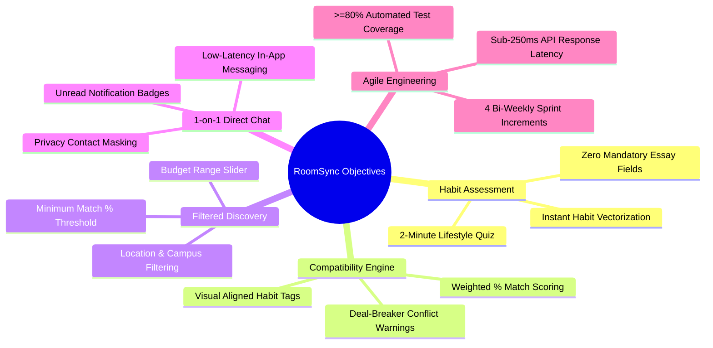
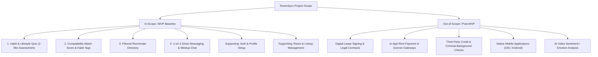
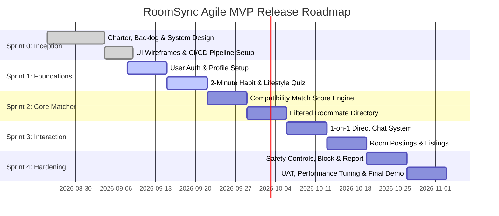

# Project Charter: RoomSync (Behavior-Based Roommate Matching Web App)

---

## 1. Project Identification & Metadata

| Attribute | Details |
| :--- | :--- |
| **Project Title** | **RoomSync** — Behavior-Based Roommate Matching Web Application |
| **Course / Program** | **192-304 Agile Software Development** — BSc in Information Technology (Year 3) |
| **Project Sponsor / Lecturer** | **Krissada Chalermsook (Oak)** |
| **Student / Author** | **Aeint Kyi Pyar Soe (6705140003)** & **Htet Soe Lin (6705140023)** |
| **Document Version** | **2.0.0 (Consolidated Agile Baseline)** |
| **Document Status** | Approved / Active Sprint Baseline |
| **Project Methodology** | Agile / Scrum with Lean Startup & Behavior-Driven Development (BDD) |
| **Target Delivery** | Academic Semester / 4 Two-Week Sprint Cycles |

---

## 2. Executive Summary & Vision

### 2.1 Vision Statement
> *"To eliminate co-living friction and awkward tenant screening by empowering renters and room posters to find living partners based on true behavioral compatibility, shared lifestyle habits, and mutual living boundaries."*

### 2.2 Executive Summary
Finding a compatible roommate is one of the most stressful challenges faced by university students and young urban renters. Traditional rental platforms and unstructured social media groups prioritize room photos, superficial dimensions, and rental pricing while ignoring daily lifestyle routines, sleep cycles, and co-living standards. This information gap frequently causes interpersonal friction, roommate conflict, broken leases, and emotional distress.

**RoomSync** is a modern, responsive web application designed and engineered under Agile/Scrum principles. It shifts roommate discovery from superficial listings to **behavior-first compatibility**. Through an engaging 2-minute lifestyle assessment, intelligent compatibility scoring, multi-criteria candidate filtering, and secure 1-on-1 direct messaging, RoomSync helps renters align on sleep schedules, cleanliness standards, guest rules, and noise tolerance before signing a lease.

---

## 3. Problem Statement & Value Proposition

### 3.1 Core Pain Points (Design Thinking: Empathize & Define)
1. **Sleep Cycle & Routine Friction**: Clashes between early risers (6:00 AM wake) and late-night workers/gamers (2:00 AM sleep) create daily noise disruptions and chronic sleep deprivation.
2. **Cleanliness & Chore Disparity**: Divergent definitions of "clean" (e.g., immediate dishwashing vs. relaxed weekend chores) lead to shared-space resentment and household arguments.
3. **Screening Discomfort & Privacy Boundaries**: Renters find it awkward to ask sensitive personal questions (e.g., guest frequency, smoking habits, pet allergies, quiet hours) through open social media direct messages.
4. **Unstructured & Inefficient Screening**: Room posters waste hours filtering through disorganized, repetitive DMs without upfront qualification of lifestyle compatibility.

### 3.2 Strategic Justification & Value Proposition
* **Root Problem Fit**: Addresses lifestyle and behavioral harmony before lease commitment rather than attempting to resolve conflict afterward.
* **Organic Growth Loop**: High viral incentive for university students to share match badges and quiz links across campus portals, student unions, and housing groups.
* **Scalable & Repeatable Model**: The behavioral matching framework seamlessly adapts across campus districts, metropolitan cities, and co-living spaces with recurring seasonal demand.

---

## 4. Project Objectives & Success Criteria (SMART)

* **Specific**: Deliver a fully responsive web application featuring a 2-minute habit quiz, multi-factor compatibility percentage scoring, filtered candidate directory, and real-time 1-on-1 direct chat.
* **Measurable**:
  * Lifestyle quiz completion time $\le 2$ minutes with a $\ge 90\%$ completion rate.
  * Matching algorithm accuracy yielding $\ge 85\%$ user-reported satisfaction during usability evaluations.
  * API response latency $\le 250\text{ ms}$ for score computation and directory queries.
  * $\ge 80\%$ automated unit and integration test coverage across all business logic modules.
  * Onboard at least 50 student/renter beta profiles during pilot acceptance testing.
* **Achievable**: Scope strictly constrained to core MVP capabilities utilizing modern web technologies and 2-week agile sprint iterations.
* **Relevant**: Directly satisfies academic requirements for **192-304 Agile Software Development** and addresses verified co-living friction.
* **Time-Bound**: Executed across 4 two-week Sprints within the semester timeline, culminating in user acceptance testing and live demo.

---

## 5. Scope Management

### 5.1 In-Scope (Minimum Viable Product — MVP)
1. **Habit & Lifestyle Quiz**:
   * Rapid 2-minute structured questionnaire capturing sleep cycle, cleanliness index (1–5 scale), guest frequency, noise tolerance, and deal-breakers (smoking, pets).
2. **Compatibility Match Score Engine**:
   * Algorithmic calculation of a 0–100% compatibility score based on normalized weighted habit vectors.
   * Visual compatibility tags highlighting aligned habits (e.g., *"Both Night Owls"*, *"Spotless Cleaners"*) and deal-breaker warning alerts.
3. **Filtered Roommate Directory**:
   * Search and filter candidate profiles by budget range, target location/campus, housing status (*"Has a Room"* vs. *"Needs a Room"*), and minimum match percentage (e.g., $\ge 80\%$).
4. **1-on-1 Direct Chat**:
   * Real-time in-app messaging enabling matched candidates to safely discuss apartment details and schedule walkthroughs without revealing phone numbers immediately.
5. **User Profile & Boundary Management**:
   * Profile setup with bio, budget limits, move-in timeline, verification badge, and non-negotiable living rules.
6. **Safety & Moderation Controls**:
   * Profile block and safety report mechanisms for secure community interactions.

### 5.2 Out-of-Scope (Future Iterations / Post-MVP)
* Automated legal tenancy lease generation and electronic signature handling.
* In-app rent splitting, utility bill division, and escrow payment processing.
* Third-party credit score checks and automated criminal background screening.
* Native iOS/Android mobile applications (MVP is delivered as a mobile-first responsive web application).
* AI-driven automated dispute mediation bot.

---

## 6. Stakeholders & Agile Scrum Roles

### 6.1 Scrum Team & Governance
| Role | Assigned Representative | Core Responsibilities |
| :--- | :--- | :--- |
| **Product Owner (PO)** | Project Team Representative | Owns product vision, manages and prioritizes the Product Backlog, writes user stories, defines acceptance criteria, accepts sprint increments. |
| **Scrum Master (SM)** | Project Team Representative | Facilitates sprint ceremonies, tracks velocity and burndown, removes technical blockers, ensures adherence to Scrum principles. |
| **Lead Developer & QA** | Full-Stack Engineering Team | Implements responsive UI, backend APIs, matching algorithm, database schemas, automated test suites, and CI/CD pipelines. |
| **Course Lecturer / Assessor** | Krissada Chalermsook (Oak) | Academic sponsor; evaluates agile process maturity, sprint deliverables, documentation rigor, and software quality for 192-304 Agile. |

### 6.2 Target User Personas
1. **Alex Chen (University Student / Room Seeker)**:
   * 21-year-old Computer Science senior. Night owl, budget-conscious ($400–$650/mo). Needs a roommate who respects quiet morning sleep and doesn't mind late-night coding/gaming.
2. **Maya Patel (Young Professional / Early Riser)**:
   * 24-year-old UX designer. Early riser (6:00 AM), maintains strict cleanliness standards, prefers quiet weeknights and no unannounced overnight guests.
3. **Ethan Vance (Master Tenant / Room Poster)**:
   * 26-year-old software engineer with a 2BR modern condo. Wants to quickly pre-screen applicants by lifestyle compatibility score to avoid awkward interview rounds and tenant turnover.

---

## 7. High-Level Agile Release Roadmap & Sprint Plan

### Sprint Milestones Overview
| Sprint | Milestone Focus | Key Deliverables | Timeline |
| :--- | :--- | :--- | :---: |
| **Sprint 0** | **Inception & Architecture** | Project Charter, SRS, Database Design, Acceptance Criteria, Git repository, CI/CD pipeline | Weeks 1–2 |
| **Sprint 1** | **Auth & Lifestyle Quiz** | User registration/login (JWT), user profiles, 2-minute lifestyle assessment quiz with state persistence | Weeks 3–4 |
| **Sprint 2** | **Matching Engine & Directory** | Weighted % match algorithm, habit tags, multi-criteria filtered directory (budget, location, min %) | Weeks 5–6 |
| **Sprint 3** | **Direct Messaging & Listings** | Real-time 1-on-1 direct chat, unread badges, conversation threads, room vacancy listings | Weeks 7–8 |
| **Sprint 4** | **Testing, Safety & Release** | Profile reporting/blocking, automated E2E tests, performance optimization, cloud deployment & demo | Weeks 9–10 |

---

## 8. Technical Architecture & Technology Stack

| Architecture Layer | Technology Selection | Justification & Rationale |
| :--- | :--- | :--- |
| **Frontend Framework** | **React.js / Next.js + Tailwind CSS** | Component-driven, mobile-first design, instant reactivity for directory filtering and quiz steps. |
| **Backend API Runtime** | **Node.js (Express) / Python (FastAPI)** | High-concurrency I/O, lightweight REST API architecture, rapid execution of matching vectors. |
| **Database Management** | **PostgreSQL 16+ (or SQLite 3.35+ dev)** | 3NF relational data integrity, JSONB support for deal-breaker tags, indexed sub-50ms queries. |
| **Real-Time Communication** | **WebSockets / Socket.io** | Low-latency bi-directional messaging for instantaneous direct chat updates. |
| **Authentication & Security** | **JWT (HMAC-SHA256) + Bcrypt** | Stateless session authorization, secure salted password storage (work factor $\ge 10$). |
| **Cloud Hosting & Storage** | **Vercel / Render + Supabase / S3** | Zero-cost agile deployment tier, seamless CI/CD integration, fast media asset delivery. |
| **CI / CD & Versioning** | **GitHub Actions + Git** | Automated linting (`ESLint`/`Prettier`), automated test runs on pull requests, semantic tagging. |

---

## 9. Risk Management Matrix (VUCA Approach)

| Risk ID | Risk Description | Category | Impact | Likelihood | Actionable Mitigation Strategy |
| :---: | :--- | :---: | :---: | :---: | :--- |
| **R-01** | **Dishonest Quiz Responses** | Volatility | High | Medium | Frame onboarding guidance highlighting that honesty prevents lease disputes; incorporate non-negotiable deal-breaker confirmations. |
| **R-02** | **Cold-Start / Sparse User Density** | Ambiguity | High | Medium | Seed realistic local university personas during pilot testing; concentrate initial launch on specific campus districts. |
| **R-03** | **Matching Algorithm Skew** | Complexity | High | Low | Implement normalized Manhattan distance with category weights; validate against edge-case persona matrices before release. |
| **R-04** | **Chat Latency & Message Drops** | Complexity | Medium | Low | Deploy resilient WebSocket connections with persistent database storage, delivery receipts, and REST fallback polling. |
| **R-05** | **Scope Creep Across Sprints** | Uncertainty | High | Medium | Strict adherence to MoSCoW prioritization; enforce Definition of Ready (DoR) and Definition of Done (DoD) before sprint commitments. |
| **R-06** | **Privacy & Harassment Risks** | Complexity | High | Low | Mask personal phone numbers and exact addresses; provide in-app direct messaging, user block, and safety report mechanisms. |

---

## 10. Agile Governance & Definition of Done (DoD)

### 10.1 Scrum Ceremonies
* **Sprint Planning**: Held at sprint kickoff to size user stories with Planning Poker (Fibonacci scale) and commit to the sprint backlog.
* **Daily Standup**: 15-minute sync answering: (1) What did I accomplish yesterday? (2) What will I do today? (3) What blockers are in my way?
* **Sprint Review & Demo**: Demonstration of working software increments to stakeholders and course instructor.
* **Sprint Retrospective**: Continuous improvement session evaluating what went well, what stalled, and action items for next sprint.

### 10.2 Definition of Done (DoD)
A User Story is accepted as **Done** only when:
1. All Gherkin acceptance criteria scenarios pass without failures.
2. Code is peer-reviewed and merged into the main branch via Pull Request.
3. Automated unit and integration tests pass with $\ge 80\%$ code coverage.
4. UI is fully responsive and verified on mobile ($360\text{px}$), tablet ($768\text{px}$), and desktop ($1280\text{px}+$ viewports).
5. Deployed to the cloud staging/demo environment with zero critical defects.
6. Security checks pass (no plaintext passwords, sanitized inputs, JWT authorization enforced).

---

## 11. Charter Authorization & Sign-Off

| Stakeholder Role | Name / Title | Status | Date |
| :--- | :--- | :---: | :---: |
| **Product Owner** | Project Team Representative | **Approved** | 2026-09-01 |
| **Scrum Master** | Project Team Representative | **Approved** | 2026-09-01 |
| **Lead Developer** | Development Team Lead | **Approved** | 2026-09-01 |
| **Academic Instructor** | Krissada Chalermsook (Oak) — 192-304 Agile | **Pending Review** | — |
