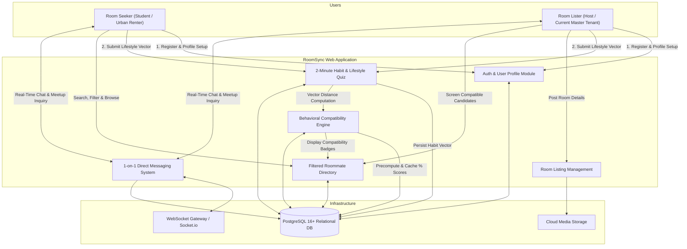
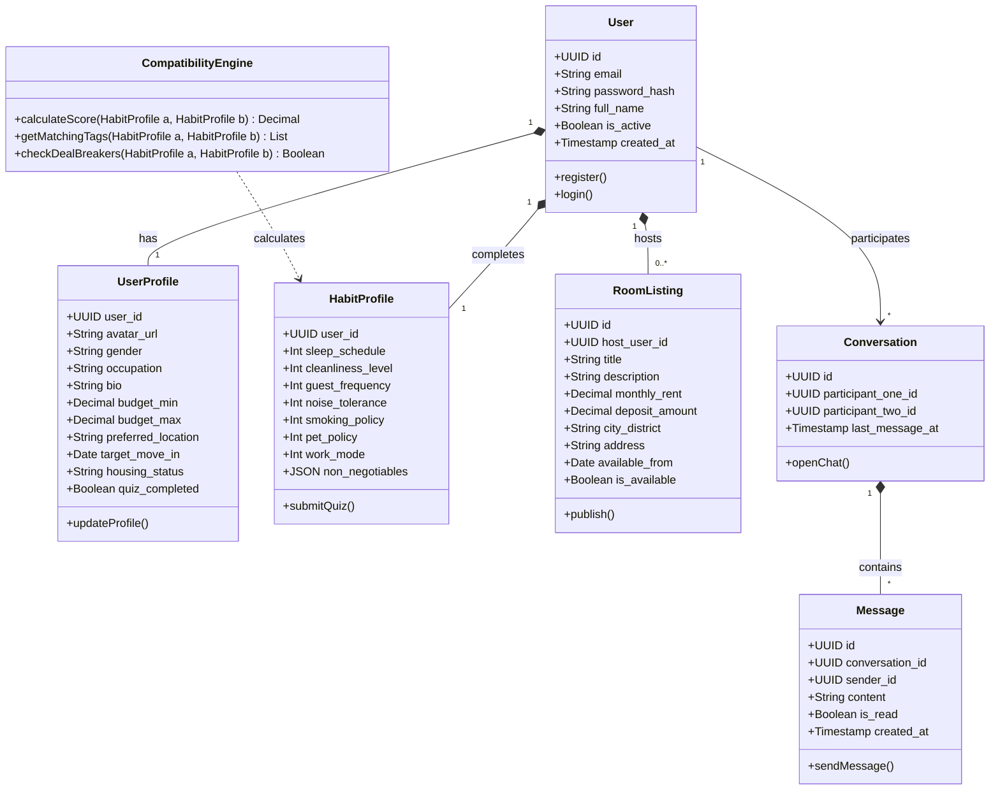
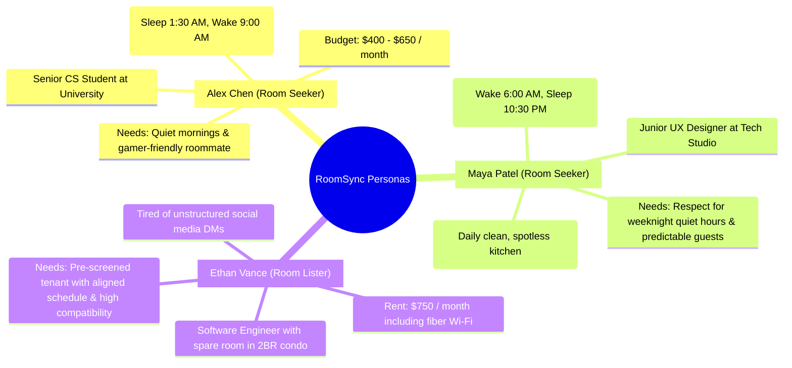
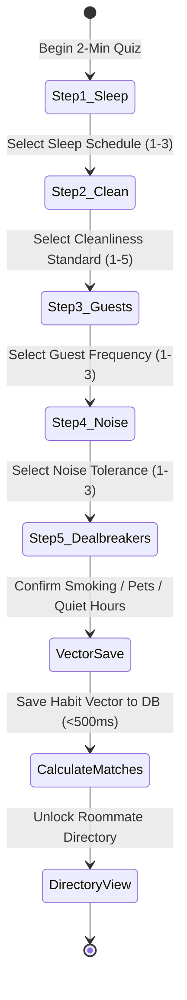
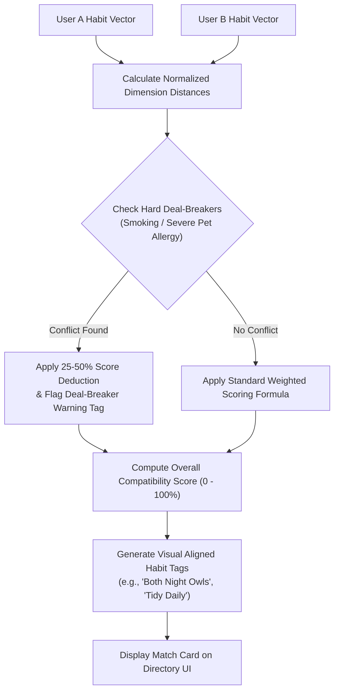

# Software Requirements Specification (SRS)
## RoomSync Platform (Behavior-Based Roommate Matching Web App)

---

## Document Control

| Attribute | Details |
| :--- | :--- |
| **Project Title** | **RoomSync** — Behavior-Based Roommate Matching Web App |
| **Course / Program** | **192-304 Agile Software Development** — BSc in IT (Year 3) |
| **Course Lecturer** | **Krissada Chalermsook (Oak)** |
| **Student / Author** | **Aeint Kyi Pyar Soe (6705140003)** & **Htet Soe Lin (6705140023)** |
| **Document Type** | Agile Software Requirements Specification (SRS) |
| **Version** | **2.0.0 (Consolidated Agile Baseline)** |
| **Status** | Approved / Baseline for Sprints |
| **Target System** | Mobile-First Responsive Web Application (Desktop, Tablet, Mobile) |

---

## 1. Introduction

### 1.1 Purpose
This Software Requirements Specification (SRS) defines the functional, non-functional, domain, and interface requirements for the **RoomSync** web application. It acts as the formal engineering agreement between the Product Owner, Agile Development Team, and Academic Evaluators for sprint backlog refinement, test-driven development (TDD), and user acceptance testing (UAT).

### 1.2 Scope of the Product
RoomSync is an intelligent, lifestyle-first roommate discovery web application. Conventional apartment search platforms evaluate properties purely by price, square footage, and photos, while ignoring the root cause of co-living conflict: **behavioral incompatibility and routine clashes**.

RoomSync addresses this market gap by delivering four core MVP capabilities:
1. **Habit & Lifestyle Assessment Quiz**: A 2-minute structured questionnaire logging sleep schedules, cleanliness habits, guest rules, noise tolerance, and deal-breakers.
2. **Compatibility Match Score Engine**: Real-time algorithmic computation of a 0–100% compatibility percentage with aligned habit tags.
3. **Filtered Roommate Directory**: Dynamic multi-criteria filtering by budget limits, target location/campus, housing status, and minimum match percentage.
4. **1-on-1 Direct Chat**: Low-latency in-app direct messaging for matched candidates to discuss room specifics and arrange meetups safely.

### 1.3 Definitions, Acronyms, and Abbreviations
* **SRS**: Software Requirements Specification
* **MVP**: Minimum Viable Product
* **BCM**: Behavioral Compatibility Matcher
* **BDD**: Behavior-Driven Development
* **JWT**: JSON Web Token
* **MoSCoW**: Must have, Should have, Could have, Won't have
* **DoD**: Definition of Done
* **DoR**: Definition of Ready
* **Gherkin**: Given-When-Then syntax for acceptance scenarios

---

## 2. Overall Description & System Context

### 2.1 System Context Diagram



### 2.2 Conceptual Architecture & Domain Model



### 2.3 User Classes and Personas



### 2.4 Operating Environment & Technical Constraints
* **Client Devices**: Responsive across Smartphones ($360\text{px}$–$480\text{px}$), Tablets ($768\text{px}$–$1024\text{px}$), and Desktop ($1280\text{px}$–$1920\text{px}$).
* **Web Browsers**: Chrome 120+, Safari 17+, Firefox 120+, Edge 120+.
* **Server Runtime**: Node.js 20+ LTS or Python 3.11+ (FastAPI).
* **Database**: PostgreSQL 16+ (or SQLite 3.35+ in local dev environment).
* **Protocols**: HTTPS (TLS 1.3) for REST APIs and WSS (Secure WebSockets) for real-time chat.

---

## 3. Functional Requirements (User Stories & Modules)

All requirements are prioritized using the **MoSCoW** convention:
* **[MUST]**: Critical for MVP release.
* **[SHOULD]**: High-value feature delivered if sprint velocity allows.
* **[COULD]**: Desirable enhancement for post-MVP.
* **[WON'T]**: Explicitly deferred to future iterations.

---

### Epic 1: Authentication & User Profile Management (UAP)

#### `FR-AUTH-01` [MUST] User Registration & Account Creation
* **User Story**: *As a new student or renter, I want to register with my email and password so that I can create a secure account and complete the lifestyle assessment.*
* **Acceptance Criteria (Gherkin)**:
  ```gherkin
  Scenario: Successful new user registration
    Given the user is on the "/register" page
    When the user enters a valid email "student@university.edu"
    And enters a full name "Alex Chen"
    And enters a password with >= 8 characters including letters and digits
    And clicks "Create Account"
    Then the system hashes the password with bcrypt (salt rounds >= 10)
    And creates the user record in the USERS table
    And returns HTTP 201 Created with a signed JWT session token
    And automatically redirects the user to "/quiz" to take the lifestyle assessment.

  Scenario: Duplicate email prevention
    Given a user account already exists with email "student@university.edu"
    When another user attempts to register with "student@university.edu"
    Then the system returns HTTP 409 Conflict
    And displays the message: "An account with this email already exists. Please log in."
  ```

#### `FR-AUTH-02` [MUST] User Authentication & Session Persistence
* **User Story**: *As a registered user, I want to securely log in so that I can resume reviewing roommate matches and chatting.*
* **Acceptance Criteria**:
  * Authenticates user against email and hashed password via JWT bearer tokens.
  * If the user has not completed the lifestyle quiz, redirects to `/quiz`.
  * If the user has completed the quiz, redirects directly to `/matches`.
  * Returns generic `401 Unauthorized` on invalid credentials without leaking email existence.

#### `FR-AUTH-03` [MUST] Profile & Housing Preference Configuration
* **User Story**: *As a registered user, I want to set up my housing preferences, budget range, and bio so that candidate roommates can see my logistical constraints.*
* **Acceptance Criteria**:
  * Users can specify Min Budget and Max Budget with client-side validation (`budget_min <= budget_max`).
  * Users select their housing role: `"Needs a Room"` vs. `"Has a Room"`.
  * Users can upload a profile avatar and specify target move-in date and location district.

---

### Epic 2: Habit & Lifestyle Assessment Quiz (HLA)



#### `FR-QUIZ-01` [MUST] 2-Minute Structured Lifestyle Questionnaire
* **User Story**: *As a user, I want to take a rapid, multi-step lifestyle assessment so that the app captures my living habits in under 2 minutes without requiring long essays.*
* **Assessment Dimension Specifications**:
  1. **Sleep Schedule**:
     * `1`: Early Riser (Wake $\le$ 7:00 AM, Sleep $\le$ 11:00 PM)
     * `2`: Balanced Routine (Sleep 11:00 PM – 1:00 AM, Wake 7:00 AM – 9:00 AM)
     * `3`: Night Owl (Sleep $\ge$ 1:00 AM, Wake $\ge$ 9:00 AM)
  2. **Cleanliness Standard**:
     * Discrete scale from `1` (Casual / Relaxed chore rotation) to `5` (Spotless / Dishes washed immediately daily).
  3. **Guest & Visitor Policy**:
     * `1`: Rare / Quiet sanctuary (No overnight guests)
     * `2`: Moderate (Occasional weekend guests with advance notice)
     * `3`: Open door / Frequent social gatherings
  4. **Noise & Study Tolerance**:
     * `1`: Quiet sanctuary (Silence required for study/sleep)
     * `2`: Moderate (Background music / headphones preferred)
     * `3`: Lively / High tolerance for music, gaming, and chatter
  5. **Non-Negotiable Deal-Breakers**:
     * Smoking: Non-smoker only (`1`), Outdoor smoker (`2`), Smoker friendly (`3`).
     * Pets: Pet allergy / No pets (`1`), Cat friendly (`2`), Dog friendly (`3`), All pets welcome (`4`).
     * Preferred Quiet Hours (e.g., `23:00` to `07:00`).
* **Acceptance Criteria (Gherkin)**:
  ```gherkin
  Scenario: Complete quiz submission under 2 minutes
    Given the authenticated user is on the "/quiz" page
    When the user completes questions 1 through 5 and clicks "Find Compatible Roommates"
    Then the system validates that all mandatory selections are present
    And persists the normalized habit vector in the HABIT_PROFILES table
    And sets user_profiles.quiz_completed = TRUE
    And redirects to "/matches" within < 1.0 second.

  Scenario: Incomplete quiz validation
    Given the user is on Step 3 of the assessment
    When the user attempts to skip to Step 4 without answering
    Then the "Next" button remains disabled and an inline error highlights the unselected option.
  ```

#### `FR-QUIZ-02` [SHOULD] Habit Recalibration & Dynamic Update
* **User Story**: *As a user whose work or study schedule has changed, I want to edit my quiz answers so that my compatibility rankings update automatically.*
* **Acceptance Criteria**:
  * Updating any response recalculates match scores across candidate profiles and refreshes cached score records.

---

### Epic 3: Behavioral Compatibility Matching Engine (CME)



#### `FR-ENG-01` [MUST] Algorithmic Multi-Factor Compatibility Score
* **User Story**: *As a user browsing candidates, I want to see an overall Compatibility Percentage (%) so that I can instantly evaluate our living harmony.*
* **Mathematical Algorithm Formulation**:
  The total compatibility score $S(A, B)$ between User $A$ and User $B$ is calculated using a normalized Manhattan distance model across $N$ behavioral dimensions:

  $$S(A, B) = \max\left(0\%, \left[ 100\% \times \left(1 - \sum_{i=1}^{N} w_i \cdot \frac{|A_i - B_i|}{\text{MaxDiff}_i}\right) \right] - \text{Penalty}_{\text{dealbreaker}}\right)$$

  **Dimension Weights ($w_i$)**:
  * **Sleep Schedule Harmony ($w_1 = 0.30$)**: $\text{MaxDiff} = 2$.
  * **Cleanliness Level ($w_2 = 0.30$)**: $\text{MaxDiff} = 4$.
  * **Guest & Visitor Policy ($w_3 = 0.20$)**: $\text{MaxDiff} = 2$.
  * **Noise & Social Tolerance ($w_4 = 0.20$)**: $\text{MaxDiff} = 2$.
  * $\sum w_i = 1.00$ ($100\%$).
  * **Deal-Breaker Penalty ($\text{Penalty}_{\text{dealbreaker}}$)**: $25\%$ to $50\%$ hard penalty if non-negotiable rules conflict (e.g., indoor smoking vs. strict non-smoker).

* **Acceptance Criteria (Gherkin)**:
  ```gherkin
  Scenario: Exact habit match returns high score
    Given User A and User B have identical sleep (3), clean (4), guest (2), and noise (2) values
    When the compatibility engine calculates their score
    Then the engine returns an overall score >= 95%
    And displays a vibrant green badge: "95%+ Compatibility".

  Scenario: Hard deal-breaker penalty enforcement
    Given User A specifies "Strict Non-Smoker" as a hard rule
    And User B is marked as "Regular Indoor Smoker"
    When the compatibility score is calculated
    Then the score applies the deal-breaker deduction
    And flags a prominent warning: "⚠️ Rule Mismatch: Smoking Policy".
  ```

#### `FR-ENG-02` [MUST] Aligned Habit Tag Generation
* **User Story**: *As a user, I want to see visual habit tags highlighting our similarities (e.g., "Both Night Owls", "Shared Cleaning Habits") so that I understand why we matched.*
* **Acceptance Criteria**:
  * Generates green tags for dimensions where $|A_i - B_i| = 0$.
  * Generates amber tags for dimensions with minor variance ($|A_i - B_i| = 1$).
  * Generates red/warning tags for severe deal-breaker mismatches.

---

### Epic 4: Filtered Roommate Directory & Candidate Discovery (FRD)

#### `FR-DIR-01` [MUST] Multi-Criteria Search & Dynamic Filtering
* **User Story**: *As a room seeker, I want to filter candidate profiles by budget, location, and minimum match percentage so that I only spend time reviewing compatible options.*
* **Filter Capabilities**:
  1. **Minimum Match Score Slider**: $50\%$ to $95\%$ threshold.
  2. **Budget Range Slider**: Dual-handle slider (`min_budget` to `max_budget`).
  3. **Target Location / District**: Dropdown filter for university clusters and city zones.
  4. **Housing Status Segment**: Toggle between `"All"`, `"Has a Room"`, and `"Needs a Room"`.
* **Acceptance Criteria (Gherkin)**:
  ```gherkin
  Scenario: Filtering directory by minimum 80% compatibility and budget
    Given the user is on the "/matches" directory page
    When the user sets the Minimum Compatibility slider to "80%"
    And sets the Max Budget filter to "$700/month"
    Then the candidate list updates dynamically within < 250ms
    And only profiles with overall_score >= 80 and budget <= 700 are displayed
    And a header counter displays: "Showing X Compatible Roommates".

  Scenario: Empty state on restrictive filters
    Given the user selects a budget < $200 and Minimum Match >= 95%
    When no candidate profiles satisfy all conditions
    Then the system displays: "No roommates found matching these criteria. Try adjusting your budget or compatibility threshold."
    And provides a "Reset Filters" button.
  ```

#### `FR-DIR-02` [MUST] Candidate Profile Card & Detail Modal
* **User Story**: *As a user, I want to click on a candidate's card to inspect their complete lifestyle breakdown, bio, and house rules.*
* **Acceptance Criteria**:
  * Candidate card displays: Avatar, Name, Verification Badge, Overall % Match Score, Budget Range, Location, and Top 3 Aligned Habit Tags.
  * Clicking card opens detailed view showing category breakdown scores, full bio, move-in date, and a prominent `"Direct Message"` CTA button.

---

### Epic 5: 1-on-1 Direct Messaging & Communication (DMI)

#### `FR-CHAT-01` [MUST] Real-Time 1-on-1 Direct Messaging
* **User Story**: *As a user who found a high-compatibility roommate, I want to message them directly in-app so that we can coordinate room details and meetups without exchanging phone numbers prematurely.*
* **Acceptance Criteria (Gherkin)**:
  ```gherkin
  Scenario: Sending an instant direct message
    Given User A is on User B's profile (Match Score >= 75%)
    When User A clicks "Message" and sends: "Hi! Saw our 88% match. Is the room still available?"
    Then a record is inserted into the MESSAGES table
    And the message is pushed via WebSockets to User B in < 300ms
    And User A sees the message bubble marked "Delivered".
  ```

#### `FR-CHAT-02` [MUST] Inbox Management & Unread Badges
* **User Story**: *As an active user, I want an inbox listing all my conversation threads with unread indicators so that I never miss an inquiry.*
* **Acceptance Criteria**:
  * Active chat list sorted in descending order by `last_message_at`.
  * Displays an unread badge counter in the navigation bar when new messages arrive.
  * Opening a thread emits a `mark_read` event and clears the unread badge.

#### `FR-CHAT-03` [MUST] Profile Safety, Block & Reporting Controls
* **User Story**: *As a privacy-conscious user, I want to block or report inappropriate users directly from chat so that my safety is protected.*
* **Acceptance Criteria**:
  * Users can click `"Block User"` to immediately close the thread and prevent further contact.
  * Users can click `"Report Profile"`, choose a violation reason, and submit a report to the `USER_SAFETY_REPORTS` table.

---

### Epic 6: Room & Sublease Postings (LMG)

#### `FR-LST-01` [SHOULD] Room Vacancy Listing Management
* **User Story**: *As a master tenant with an open room, I want to create a room listing with rent, photos, and location so that seekers can view the living space alongside my habit profile.*
* **Acceptance Criteria**:
  * Form captures room title, monthly rent, deposit amount, address, district, move-in availability date, and photo URLs.
  * Published listings link directly to the host's verified habit profile.

---

## 4. Non-Functional Requirements (NFRs)

```mermaid
quadrantChart
    title Non-Functional Requirements Matrix
    x-axis Low Technical Complexity --> High Technical Complexity
    y-axis Low System Impact --> Critical System Impact
    quadrant-1 High Priority and Complex (Security, WebSockets)
    quadrant-2 High Priority Quick Wins (Mobile Layout, Fast Quiz)
    quadrant-3 Nice to Have (Advanced Caching)
    quadrant-4 Architectural Hygiene (Linting, Modularity)
    "JWT Session & Bcrypt Hash": [0.70, 0.92]
    "Real-Time Chat Latency <300ms": [0.82, 0.88]
    "Mobile Responsive Layout (360px+)": [0.25, 0.90]
    "Quiz Completion Time <2 mins": [0.20, 0.85]
    "Match Calculation Latency <150ms": [0.45, 0.82]
    "99.5% System Availability": [0.60, 0.75]
    "Test Coverage >=80%": [0.40, 0.78]
```

### 4.1 Performance & Scalability
* **`NFR-PERF-01` (Match Calculation Latency)**: Pairwise compatibility calculation must execute in $\le 150\text{ ms}$ for real-time rendering. Directory queries across 500+ candidates must return in $\le 250\text{ ms}$.
* **`NFR-PERF-02` (Page Load Speed)**: First Contentful Paint (FCP) must be $\le 1.2\text{ seconds}$ on standard 4G mobile connections.
* **`NFR-PERF-03` (Chat Propagation)**: End-to-end message transmission via WebSockets must be $\le 300\text{ ms}$ under normal network conditions.

### 4.2 Security & Data Privacy
* **`NFR-SEC-01` (Password Hashing)**: User passwords must be hashed using `bcrypt` (work factor $\ge 10$) or `argon2`. Plaintext passwords must never be logged or stored.
* **`NFR-SEC-02` (Session Authorization)**: All private endpoints must validate signed stateless JWT tokens with standard 24-hour expiration.
* **`NFR-SEC-03` (Contact Information Masking)**: Personal phone numbers, emails, and exact apartment street numbers must remain hidden until users mutually initiate direct chat.
* **`NFR-SEC-04` (Raw Habit Data Protection)**: Public API responses must return aggregate match percentages and category tags rather than exposing raw internal habit vectors.

### 4.3 Usability & Accessibility (a11y)
* **`NFR-USE-01` (Mobile-First Responsiveness)**: UI layout must adapt cleanly from $360\text{px}$ (mobile) to $1920\text{px}$ (desktop) with zero horizontal overflow.
* **`NFR-USE-02` (Accessibility Compliance)**: The application must meet **WCAG 2.1 Level AA** standards with a minimum text contrast ratio of $4.5:1$ and full keyboard navigation.
* **`NFR-USE-03` (Frictionless Onboarding)**: The lifestyle quiz must be completable in $\le 2$ minutes with zero mandatory open-ended essay fields.

### 4.4 Reliability & Maintainability
* **`NFR-REL-01` (System Availability)**: Staging and production instances must achieve $\ge 99.5\%$ uptime during academic demo and evaluation cycles.
* **`NFR-MAINT-01` (Test Coverage)**: The codebase must maintain $\ge 80\%$ automated unit and integration test coverage across all scoring, filter, and auth modules.

---

## 5. External Interface & REST API Specifications

### 5.1 RESTful API Endpoint Directory

| Method | Route Path | Description | Request Payload / Query Params | Auth |
| :--- | :--- | :--- | :--- | :---: |
| `POST` | `/api/auth/register` | Register new user account | `{ email, password, full_name, role }` | No |
| `POST` | `/api/auth/login` | Authenticate user and issue JWT | `{ email, password }` | No |
| `GET` | `/api/users/me` | Get current user profile and quiz status | — | Yes |
| `PUT` | `/api/users/profile` | Update profile preferences and budget | `{ bio, budget_min, budget_max, location }` | Yes |
| `POST` | `/api/quiz/submit` | Submit 2-minute lifestyle quiz vector | `{ sleep, clean, guest, noise, smoking, pet }`| Yes |
| `GET` | `/api/matches` | Get candidate directory with calculated % | `?min_match=80&max_budget=700&location=All` | Yes |
| `GET` | `/api/matches/:userId` | Get detailed compatibility breakdown | — | Yes |
| `GET` | `/api/conversations` | List user's active direct chat threads | — | Yes |
| `POST` | `/api/conversations` | Initiate a new direct chat thread | `{ recipient_user_id, listing_id? }` | Yes |
| `GET` | `/api/conversations/:id/messages`| Fetch chronological chat messages | `?limit=50&offset=0` | Yes |
| `POST` | `/api/conversations/:id/messages`| Send a direct chat message | `{ content }` | Yes |
| `POST` | `/api/safety/report` | Submit a safety violation report | `{ reported_user_id, report_type, reason }` | Yes |

### 5.2 UI Design Guidelines & Visual Hierarchy
* **Color Palette**:
  * Primary Accent: Deep Indigo (`#4F46E5`) / Modern Violet (`#7C3AED`) representing trust and intelligence.
  * Compatibility Highlights: Teal (`#0D9488`) and Emerald Green (`#10B981`) for high compatibility ($\ge 80\%$).
  * Warning Indicators: Amber (`#F59E0B`) for moderate alignment ($60\text{--}79\%$) and Coral Red (`#EF4444`) for deal-breakers.
* **Navigation Flow**:
  * Mobile-first persistent bottom navigation: **Discover (Directory)** | **Messages (Chat)** | **My Room** | **Profile**.

---

## 6. Requirements Traceability Matrix (RTM)

| Requirement ID | Epic / Module | Target Sprint | Story Points | Verification Method |
| :--- | :--- | :---: | :---: | :--- |
| `FR-AUTH-01` | Auth & Profile | Sprint 1 | 3 | Automated Unit Tests & Integration Tests |
| `FR-AUTH-02` | Auth & Profile | Sprint 1 | 2 | JWT Auth Guard & Expiration Tests |
| `FR-AUTH-03` | Auth & Profile | Sprint 1 | 2 | Profile Validation & Form Edge-Case Tests |
| `FR-QUIZ-01` | 2-Min Habit Quiz | Sprint 1 | 5 | Usability Timing Test ($\le 2\text{ min}$) & Vector Save |
| `FR-QUIZ-02` | 2-Min Habit Quiz | Sprint 2 | 2 | Recalculation Trigger & Mutation Test |
| `FR-ENG-01` | Compatibility Engine | Sprint 2 | 5 | Algorithmic Unit Tests (100%, 50%, Penalized) |
| `FR-ENG-02` | Compatibility Engine | Sprint 2 | 3 | Tag Generation Matrix & Badge Render Test |
| `FR-DIR-01` | Filtered Directory | Sprint 2 | 5 | Multi-criteria Filter Speed & Boundary Test |
| `FR-DIR-02` | Filtered Directory | Sprint 2 | 3 | Mobile Card Layout & Modal View QA |
| `FR-CHAT-01` | 1-on-1 Direct Chat | Sprint 3 | 5 | WebSocket Delivery Latency Test ($\le 300\text{ms}$) |
| `FR-CHAT-02` | 1-on-1 Direct Chat | Sprint 3 | 3 | Unread Badge State Management Test |
| `FR-CHAT-03` | Direct Chat Safety | Sprint 4 | 3 | Block / Report Cascade & Security Check |
| `FR-LST-01` | Room Listings | Sprint 3 | 5 | Listing CRUD API & Media Asset Check |
| `NFR-PERF-01` | Performance | Sprint 2-4 | — | Benchmark Latency Scan ($\le 150\text{ms}$) |
| `NFR-SEC-01` | Security | Sprint 1-4 | — | OWASP Security Scan & Password Hashing Audit |

---

## 7. Approval & Sign-Off

| Stakeholder Role | Name / Title | Status | Date |
| :--- | :--- | :---: | :---: |
| **Product Owner** | Project Team Representative | **Approved** | 2026-09-01 |
| **Scrum Master** | Project Team Representative | **Approved** | 2026-09-01 |
| **Lead Developer** | Development Team Lead | **Approved** | 2026-09-01 |
| **Course Assessor** | Krissada Chalermsook (Oak) — 192-304 Agile | **Pending Evaluation** | — |
